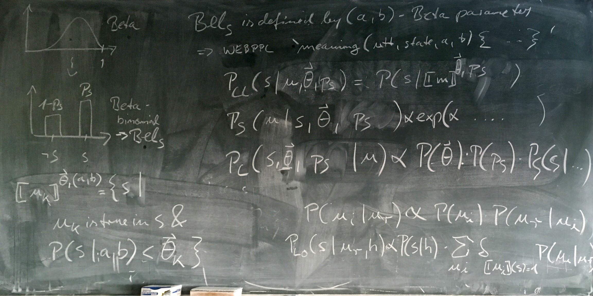

```{r setup, include=FALSE, message=FALSE, warning=FALSE}
knitr::opts_chunk$set(echo = TRUE)
library(rwebppl)
library(tidyverse)
library(fitdistrplus)
library(gridExtra)
library(scales)
library(grid)

data <- read_csv("data/before_after_ratings.csv") %>% mutate_at(vars(id,story:experiment,Qtype,condition:eligible), factor) %>% filter(eligible=="True")

prior_ratings <- data %>% filter(condition=="before" & Qtype %in% c("predictable","unpredictable") & world %in% c("typical","wonky"))

prior_typ_pred <- prior_ratings %>% filter(world=="typical" & Qtype=="predictable")
prior_wonk_pred <- prior_ratings %>% filter(world=="wonky" & Qtype=="predictable")
prior_typ_unpred <- prior_ratings %>% filter(world=="typical" & Qtype=="unpredictable")
prior_wonk_unpred <- prior_ratings %>% filter(world=="wonky" & Qtype=="unpredictable")

posterior_ratings <- data %>% filter(condition=="after" & as.character(Qtype) == as.character(activity) & world %in% c("typical","wonky"))

posterior_typ_pred <- posterior_ratings %>% filter(world=="typical" & activity=="predictable")
posterior_wonk_pred <- posterior_ratings %>% filter(world=="wonky" & activity=="predictable")
posterior_typ_unpred <- posterior_ratings %>% filter(world=="typical" & activity=="unpredictable")
posterior_wonk_unpred <- posterior_ratings %>% filter(world=="wonky" & activity=="unpredictable")

posterior_typ_pred_empty <- data %>% filter(condition=="after" & Qtype == "predictable" & world == "typical" & activity=="unpredictable")

posterior_wonk_pred_empty <- data %>% filter(condition=="after" & Qtype == "predictable" & world == "wonky" & activity=="unpredictable")

######## Functions

scale_ratings <- function(rating) {
  (rating/100 - min(rating/100) + 0.001) / (max(rating/100) - min(rating/100) + 0.002)
}

dist_one <- function(result,title) {
  ggplot(result, aes(x = habituality, y = prob)) + 
    geom_bar(stat="identity", fill = "#E69F00", colour="black") + 
    ylim(0,0.5) + 
    ggtitle(title)
}

dist_both <- function(result,title,levels) {
  cond1 <- filter(result, state=="happened") %>%
    dplyr::select(habituality, prob)
  cond1 <- tibble(state = "happened", 
                  habituality = create_data(cond1))
  cond2 <- filter(result, state=="didn't happen") %>%
    dplyr::select(habituality, prob)
  cond2 <- tibble(state = "didn't happen", 
                  habituality = create_data(cond2))
  result <- bind_rows(list(cond1, cond2))
  result$state <- factor(result$state, levels=levels)
  ggplot(result, aes(x=habituality, fill=state)) + 
    geom_density(alpha=0.5) + 
    scale_fill_manual(values=c("#E69F00", "#999999", "#56B4E9"), drop=FALSE) + 
    ylim(0,32.5) + 
    ggtitle(title)
}

results <- function(result, title, levels) {
  if ("support" %in% colnames(result)) {
    result <- rename(result, state = support)
  }
  table <- tableGrob(result)
  result$state <- factor(result$state, levels=levels)
  plot <- ggplot(result, aes(x=state, y=prob)) + 
    geom_bar(stat="identity") + 
    scale_y_continuous(labels=percent, name="percent", limits = c(0,1.01)) + 
    scale_x_discrete(drop=FALSE)
  grid.arrange(top=textGrob(title, gp=gpar(fontsize=13.2)), 
               table, plot, ncol=2)
}

prob_state <- function(result) {
  result %>% 
    dplyr::select(state, prob) %>% 
    group_by(state) %>% 
    summarize(prob = sum(prob))
}

prob_habit <- function(result) {
  result %>% 
    group_by(habituality) %>% 
    summarize(prob = sum(prob))
}
```

```{r typ pred fit, echo=FALSE}
# scale to remove 0 and 1 values (add/subtract 0.001 from edges)
prior_typ_pred_scaled <- scale_ratings(prior_typ_pred$rating)

# fit beta distribution by maximum likelihood estimation
fit.prior_typ_pred <- fitdist(prior_typ_pred_scaled, "beta", method="mle")
```
```{r typ pred summary, echo=FALSE}
js.prior_pred <- paste0("var beta_high_a = ",fit.prior_typ_pred$estimate[1],"\n","var beta_high_b = ",fit.prior_typ_pred$estimate[2],"\n","var beta_low_a = 0.59051473988806","\n","var beta_low_b = 0.599422405762914","\n")
```

## "(...)" (almost) can't be misremembered

Making zero utterance almost impossible to misremember breaks the model.

```{r null base model, echo=FALSE, message=FALSE, warning=FALSE}
base_model <- paste0(js.prior_pred, "\nvar world_type = \"ordinary\"\n\n", paste(readLines("models/noisy_hrsa_null.webppl"), collapse="\n"))
```

```{r null noisy hRSA model, echo=FALSE, message=FALSE, warning=FALSE, cache=TRUE}
l0_95 <- webppl(paste(base_model, "literalListener(\"(...)\",0.95)", sep="\n"))
l0_50 <- webppl(paste(base_model, "literalListener(\"(...)\",0.5)", sep="\n"))
l0_5 <- webppl(paste(base_model, "literalListener(\"(...)\",0.05)", sep="\n"))

s_95 <- webppl(paste(base_model, "speaker(\"happened\",0.95)", sep="\n"))
s_50 <- webppl(paste(base_model, "speaker(\"happened\",0.5)", sep="\n"))
s_5 <- webppl(paste(base_model, "speaker(\"happened\",0.05)", sep="\n"))

l1_empty <- as_tibble(webppl(paste(base_model, "pragmaticListener(\"(...)\",\"both\")", sep="\n")))
l1_plain <- as_tibble(webppl(paste(base_model, "pragmaticListener(\"plain\",\"both\")", sep="\n")))
l1_exclamation <- as_tibble(webppl(paste(base_model, "pragmaticListener(\"exclamation\",\"both\")", sep="\n")))
l1_ohyeah <- as_tibble(webppl(paste(base_model, "pragmaticListener(\"oh yeah\",\"both\")", sep="\n")))

l1_empty_habit <- prob_habit(l1_empty)
l1_plain_habit <- prob_habit(l1_plain)
l1_exclamation_habit <- prob_habit(l1_exclamation)
l1_ohyeah_habit <- prob_habit(l1_ohyeah)

l1_empty_state <- prob_state(l1_empty)
l1_plain_state <- prob_state(l1_plain)
l1_exclamation_state <- prob_state(l1_exclamation)
l1_ohyeah_state <- prob_state(l1_ohyeah)
```

```{js null noisy hRSA code, eval=FALSE, code=base_model}
```

### Results

#### Literal listener

```{r null noisy hRSA plots 1, fig.height = 2, echo=FALSE}
utterances <- c("(...)","plain","exclamation","oh yeah")
states <- c("happened","didn't happen")

results(l0_95,"Literal Listener: \"(...)\", 95% Habitual Activity", states)
results(l0_50,"Literal Listener: \"(...)\", 50% Habitual Activity", states)
results(l0_5,"Literal Listener: \"(...)\", 5% Habitual Activity", states)
```

#### Speaker

```{r null noisy hRSA plots 2, fig.height = 2, echo=FALSE}
results(s_95,"Speaker: Activity Happened, 95% Habitual Activity", utterances)
results(s_50,"Speaker: Activity Happened, 50% Habitual Activity", utterances)
results(s_5,"Speaker: Activity Happened, 5% Habitual Activity", utterances)
```

#### Pragmatic listener

```{r null noisy hRSA plots 3, fig.height = 2, echo=FALSE}
dist_one(l1_empty_habit,"Pragmatic Listener: \"(...)\" (`habituality` only)")
dist_one(l1_plain_habit,"Pragmatic Listener: \"John paid the cashier.\" (`habituality` only)")
dist_one(l1_exclamation_habit,"Pragmatic Listener: \"John paid the cashier!\" (`habituality` only)")
dist_one(l1_ohyeah_habit,"Pragmatic Listener: \"Oh yeah, and John paid the cashier.\" (`habituality` only)")

results(l1_empty_state,"Pragmatic Listener: \"(...)\" (`state` only)", states)
results(l1_plain_state,"Pragmatic Listener: \"John paid the cashier.\" (`state` only)", states)
results(l1_exclamation_state,"Pragmatic Listener: \"John paid the cashier!\" (`state` only)", states)
results(l1_ohyeah_state,"Pragmatic Listener: \"Oh yeah, and John paid the cashier.\" (`state` only)", states)

# dist_both(l1_empty,"Pragmatic Listener: \"(...)\"", states)
# dist_both(l1_plain,"Pragmatic Listener: \"John paid the cashier.\"", states)
# dist_both(l1_exclamation,"Pragmatic Listener: \"John paid the cashier!\"", states)
# dist_both(l1_ohyeah,"Pragmatic Listener: \"Oh yeah, and John paid the cashier.\"", states)
```

### Comparison to empirical results

```{r null empirical results 1, fig.height = 6, echo=FALSE}
data_empty <- tibble(rating = posterior_typ_pred_empty$rating/100)
data_plain <- (filter(posterior_typ_pred, experiment=="period") %>% dplyr::select(rating))/100
data_exclamation <- (filter(posterior_typ_pred, experiment=="exclamation") %>% dplyr::select(rating))/100
data_ohyeah <- (filter(posterior_typ_pred, experiment=="ohyeah") %>% dplyr::select(rating))/100

experiment <- c(rep("\"(...)\"",nrow(data_empty)), rep("\"John paid the\ncashier.\"",nrow(data_plain)), rep("\"John paid the\ncashier!\"",nrow(data_exclamation)), rep("\"Oh yeah, and John\npaid the cashier.\"",nrow(data_ohyeah)))

empirical <- tibble(experiment = experiment, 
                    habituality = c(data_empty$rating, 
                                    data_plain$rating, 
                                    data_exclamation$rating, 
                                    data_ohyeah$rating)) %>% 
  mutate_if(is.character, as.factor)

experiment <- c(rep("\"(...)\"",20), rep("\"John paid the\ncashier.\"",20), rep("\"John paid the\ncashier!\"",20), rep("\"Oh yeah, and John\npaid the cashier.\"",20))

predicted <- tibble(experiment = experiment,
                    habituality = c(l1_empty_habit$habituality, 
                                    l1_plain_habit$habituality, 
                                    l1_exclamation_habit$habituality, 
                                    l1_ohyeah_habit$habituality),
                    prob = c(l1_empty_habit$prob, 
                                    l1_plain_habit$prob, 
                                    l1_exclamation_habit$prob, 
                                    l1_ohyeah_habit$prob)) %>% 
  mutate_if(is.character, as.factor)

empirical$experiment <- factor(empirical$experiment, levels=c("\"(...)\"","\"John paid the\ncashier.\"","\"John paid the\ncashier!\"","\"Oh yeah, and John\npaid the cashier.\""))
predicted$experiment <- factor(predicted$experiment, levels=c("\"(...)\"","\"John paid the\ncashier.\"","\"John paid the\ncashier!\"","\"Oh yeah, and John\npaid the cashier.\""))

empiricalPlot <- ggplot(empirical, aes(x=habituality)) + geom_density(fill="#E69F00") + facet_wrap(.~experiment, ncol = 1)
predictedPlot <- ggplot(predicted, aes(x = habituality, y = prob)) +geom_bar(stat="identity", fill = "#E69F00", colour="black") + facet_wrap(.~experiment, ncol = 1)

title <- "Empirical vs. Predicted Probability Densities"

grid.arrange(top=textGrob(title, gp=gpar(fontsize=13.2)), 
               empiricalPlot, predictedPlot, ncol=2)
```

```{r null empirical results 2, fig.height = 4, echo=FALSE}
empirical <- empirical %>% group_by(experiment) %>% summarize(habituality = mean(habituality, na.rm=TRUE)) %>% mutate(type="Empirical")

predicted <- predicted %>% mutate(habitProb = habituality * prob) %>% group_by(experiment) %>% summarize(habituality = sum(habitProb)) %>% mutate(type="Predicted")

comparison <- bind_rows(list(empirical, predicted))

comparison %>% group_by(type,experiment) %>% summarize(habituality = mean(habituality, na.rm=TRUE)) %>% ggplot(aes(x=type, y=habituality, fill=type)) + geom_bar(stat="identity") + facet_grid(. ~ experiment) + scale_y_continuous(labels = percent_format(), limits = c(0,1)) + scale_fill_manual(values=c("#999999", "#E69F00", "#56B4E9")) + ggtitle("Empirical vs. Predicted Habituality Means")
```


## "(...)" extremely unlikely to be misremembered

Making zero utterance extremely unlikely to be misremembered breaks the model, unless utility-maximizing optimality set extremely high.

```{r null diff base model, echo=FALSE, message=FALSE, warning=FALSE}
base_model <- paste0(js.prior_pred, "\nvar world_type = \"ordinary\"\n\n", paste(readLines("models/noisy_hrsa_null_diff.webppl"), collapse="\n"))
```

```{r null diff noisy hRSA model, echo=FALSE, message=FALSE, warning=FALSE, cache=TRUE}
l0_95 <- webppl(paste(base_model, "literalListener(\"(...)\",0.95)", sep="\n"))
l0_50 <- webppl(paste(base_model, "literalListener(\"(...)\",0.5)", sep="\n"))
l0_5 <- webppl(paste(base_model, "literalListener(\"(...)\",0.05)", sep="\n"))

s_95 <- webppl(paste(base_model, "speaker(\"happened\",0.95)", sep="\n"))
s_50 <- webppl(paste(base_model, "speaker(\"happened\",0.5)", sep="\n"))
s_5 <- webppl(paste(base_model, "speaker(\"happened\",0.05)", sep="\n"))

l1_empty <- as_tibble(webppl(paste(base_model, "pragmaticListener(\"(...)\",\"both\")", sep="\n")))
l1_plain <- as_tibble(webppl(paste(base_model, "pragmaticListener(\"plain\",\"both\")", sep="\n")))
l1_exclamation <- as_tibble(webppl(paste(base_model, "pragmaticListener(\"exclamation\",\"both\")", sep="\n")))
l1_ohyeah <- as_tibble(webppl(paste(base_model, "pragmaticListener(\"oh yeah\",\"both\")", sep="\n")))

l1_empty_habit <- prob_habit(l1_empty)
l1_plain_habit <- prob_habit(l1_plain)
l1_exclamation_habit <- prob_habit(l1_exclamation)
l1_ohyeah_habit <- prob_habit(l1_ohyeah)

l1_empty_state <- prob_state(l1_empty)
l1_plain_state <- prob_state(l1_plain)
l1_exclamation_state <- prob_state(l1_exclamation)
l1_ohyeah_state <- prob_state(l1_ohyeah)
```

```{js null diff noisy hRSA code, eval=FALSE, code=base_model}
```

### Results

#### Literal listener

```{r null diff noisy hRSA plots 1, fig.height = 2, echo=FALSE}
utterances <- c("(...)","plain","exclamation","oh yeah")
states <- c("happened","didn't happen")

results(l0_95,"Literal Listener: \"(...)\", 95% Habitual Activity", states)
results(l0_50,"Literal Listener: \"(...)\", 50% Habitual Activity", states)
results(l0_5,"Literal Listener: \"(...)\", 5% Habitual Activity", states)
```

#### Speaker

```{r null diff noisy hRSA plots 2, fig.height = 2, echo=FALSE}
results(s_95,"Speaker: Activity Happened, 95% Habitual Activity", utterances)
results(s_50,"Speaker: Activity Happened, 50% Habitual Activity", utterances)
results(s_5,"Speaker: Activity Happened, 5% Habitual Activity", utterances)
```

#### Pragmatic listener

```{r null diff noisy hRSA plots 3, fig.height = 2, echo=FALSE}
dist_one(l1_empty_habit,"Pragmatic Listener: \"(...)\" (`habituality` only)")
dist_one(l1_plain_habit,"Pragmatic Listener: \"John paid the cashier.\" (`habituality` only)")
dist_one(l1_exclamation_habit,"Pragmatic Listener: \"John paid the cashier!\" (`habituality` only)")
dist_one(l1_ohyeah_habit,"Pragmatic Listener: \"Oh yeah, and John paid the cashier.\" (`habituality` only)")

results(l1_empty_state,"Pragmatic Listener: \"(...)\" (`state` only)", states)
results(l1_plain_state,"Pragmatic Listener: \"John paid the cashier.\" (`state` only)", states)
results(l1_exclamation_state,"Pragmatic Listener: \"John paid the cashier!\" (`state` only)", states)
results(l1_ohyeah_state,"Pragmatic Listener: \"Oh yeah, and John paid the cashier.\" (`state` only)", states)

# dist_both(l1_empty,"Pragmatic Listener: \"(...)\"", states)
# dist_both(l1_plain,"Pragmatic Listener: \"John paid the cashier.\"", states)
# dist_both(l1_exclamation,"Pragmatic Listener: \"John paid the cashier!\"", states)
# dist_both(l1_ohyeah,"Pragmatic Listener: \"Oh yeah, and John paid the cashier.\"", states)
```

### Comparison to empirical results

```{r null diff empirical results 1, fig.height = 6, echo=FALSE}
data_empty <- tibble(rating = posterior_typ_pred_empty$rating/100)
data_plain <- (filter(posterior_typ_pred, experiment=="period") %>% dplyr::select(rating))/100
data_exclamation <- (filter(posterior_typ_pred, experiment=="exclamation") %>% dplyr::select(rating))/100
data_ohyeah <- (filter(posterior_typ_pred, experiment=="ohyeah") %>% dplyr::select(rating))/100

experiment <- c(rep("\"(...)\"",nrow(data_empty)), rep("\"John paid the\ncashier.\"",nrow(data_plain)), rep("\"John paid the\ncashier!\"",nrow(data_exclamation)), rep("\"Oh yeah, and John\npaid the cashier.\"",nrow(data_ohyeah)))

empirical <- tibble(experiment = experiment, 
                    habituality = c(data_empty$rating, 
                                    data_plain$rating, 
                                    data_exclamation$rating, 
                                    data_ohyeah$rating)) %>% 
  mutate_if(is.character, as.factor)

experiment <- c(rep("\"(...)\"",20), rep("\"John paid the\ncashier.\"",20), rep("\"John paid the\ncashier!\"",20), rep("\"Oh yeah, and John\npaid the cashier.\"",20))

predicted <- tibble(experiment = experiment,
                    habituality = c(l1_empty_habit$habituality, 
                                    l1_plain_habit$habituality, 
                                    l1_exclamation_habit$habituality, 
                                    l1_ohyeah_habit$habituality),
                    prob = c(l1_empty_habit$prob, 
                                    l1_plain_habit$prob, 
                                    l1_exclamation_habit$prob, 
                                    l1_ohyeah_habit$prob)) %>% 
  mutate_if(is.character, as.factor)

empirical$experiment <- factor(empirical$experiment, levels=c("\"(...)\"","\"John paid the\ncashier.\"","\"John paid the\ncashier!\"","\"Oh yeah, and John\npaid the cashier.\""))
predicted$experiment <- factor(predicted$experiment, levels=c("\"(...)\"","\"John paid the\ncashier.\"","\"John paid the\ncashier!\"","\"Oh yeah, and John\npaid the cashier.\""))

empiricalPlot <- ggplot(empirical, aes(x=habituality)) + geom_density(fill="#E69F00") + facet_wrap(.~experiment, ncol = 1)
predictedPlot <- ggplot(predicted, aes(x = habituality, y = prob)) +geom_bar(stat="identity", fill = "#E69F00", colour="black") + facet_wrap(.~experiment, ncol = 1)

title <- "Empirical vs. Predicted Probability Densities"

grid.arrange(top=textGrob(title, gp=gpar(fontsize=13.2)), 
               empiricalPlot, predictedPlot, ncol=2)
```

```{r null diff empirical results 2, fig.height = 4, echo=FALSE}
empirical <- empirical %>% group_by(experiment) %>% summarize(habituality = mean(habituality, na.rm=TRUE)) %>% mutate(type="Empirical")

predicted <- predicted %>% mutate(habitProb = habituality * prob) %>% group_by(experiment) %>% summarize(habituality = sum(habitProb)) %>% mutate(type="Predicted")

comparison <- bind_rows(list(empirical, predicted))

comparison %>% group_by(type,experiment) %>% summarize(habituality = mean(habituality, na.rm=TRUE)) %>% ggplot(aes(x=type, y=habituality, fill=type)) + geom_bar(stat="identity") + facet_grid(. ~ experiment) + scale_y_continuous(labels = percent_format(), limits = c(0,1)) + scale_fill_manual(values=c("#999999", "#E69F00", "#56B4E9")) + ggtitle("Empirical vs. Predicted Habituality Means")
```

## Threshold

<!--  -->

* $P_{L_0}(s|u,\boldsymbol\theta,h) \propto P(s|[\![m]\!]^{\boldsymbol\theta,h})$
* $P_{S_1}(u|s,\boldsymbol\theta,h;\alpha,C) \propto  P(u;C)\exp(\alpha\log P_{L_0}(s|u,\boldsymbol\theta,h))$
* $P_{L_1}(s,\boldsymbol\theta,h|u) \propto P_{S_1}(u|s,\boldsymbol\theta,h;\alpha,C) \cdot P(\boldsymbol\theta) \cdot P(s|h) \cdot P(h)$

```{r threshold base model, echo=FALSE, message=FALSE, warning=FALSE}
base_model <- paste0(js.prior_pred,  paste(readLines("models/threshold.webppl"), collapse="\n"))
```

```{r threshold hRSA model, echo=FALSE, message=FALSE, warning=FALSE}
l0_empty <- as_tibble(webppl(paste(base_model, "literalListener(\"(...)\", 0.7, 0.3, 0.3, \"habitual\")", sep="\n")))
l0_plain <- as_tibble(webppl(paste(base_model, "literalListener(\"plain\", 0.7, 0.3, 0.3, \"habitual\")", sep="\n")))
l0_exc <- as_tibble(webppl(paste(base_model, "literalListener(\"exclamation\", 0.7, 0.3, 0.3, \"habitual\")", sep="\n")))
l0_ohyeah <- as_tibble(webppl(paste(base_model, "literalListener(\"oh yeah\", 0.7, 0.3, 0.3, \"habitual\")", sep="\n")))

s_675 <- as_tibble(webppl(paste(base_model, "speaker(\"happened\",0.675, 0.7, 0.3, 0.3, \"habitual\")", sep="\n")))
s_275 <- as_tibble(webppl(paste(base_model, "speaker(\"happened\",0.275, 0.7, 0.3, 0.3, \"habitual\")", sep="\n")))
s_025 <- as_tibble(webppl(paste(base_model, "speaker(\"happened\",0.025, 0.7, 0.3, 0.3, \"habitual\")", sep="\n")))

l1_empty <- as_tibble(webppl(paste(base_model, "pragmaticListener(\"(...)\", \"habitual\")", sep="\n")))
l1_plain <- as_tibble(webppl(paste(base_model, "pragmaticListener(\"plain\", \"habitual\")", sep="\n")))
l1_exclamation <- as_tibble(webppl(paste(base_model, "pragmaticListener(\"exclamation\", \"habitual\")", sep="\n")))
l1_ohyeah <- as_tibble(webppl(paste(base_model, "pragmaticListener(\"oh yeah\", \"habitual\")", sep="\n")))

l1_empty_habit <- l1_empty %>% filter(Parameter=="habituality") %>% dplyr::select(habituality=value) %>% mutate(habituality=as.numeric(habituality)) %>% group_by(habituality) %>% summarize(prob=n()/50000)
l1_plain_habit <- l1_plain %>% filter(Parameter=="habituality") %>% dplyr::select(habituality=value) %>% mutate(habituality=as.numeric(habituality)) %>% group_by(habituality) %>% summarize(prob=n()/50000)
l1_exclamation_habit <- l1_exclamation %>% filter(Parameter=="habituality") %>% dplyr::select(habituality=value) %>% mutate(habituality=as.numeric(habituality)) %>% group_by(habituality) %>% summarize(prob=n()/50000)
l1_ohyeah_habit <- l1_ohyeah %>% filter(Parameter=="habituality") %>% dplyr::select(habituality=value) %>% mutate(habituality=as.numeric(habituality)) %>% group_by(habituality) %>% summarize(prob=n()/50000)

l1_empty_state <- l1_empty %>% filter(Parameter=="state") %>% dplyr::select(state=value) %>% group_by(state) %>% summarize(prob=n()/nrow(filter(l1_empty, Parameter=="state")))
l1_plain_state <- l1_plain %>% filter(Parameter=="state") %>% dplyr::select(state=value) %>% group_by(state) %>% summarize(prob=n()/nrow(filter(l1_empty, Parameter=="state")))
l1_exclamation_state <- l1_exclamation %>% filter(Parameter=="state") %>% dplyr::select(state=value) %>% group_by(state) %>% summarize(prob=n()/nrow(filter(l1_empty, Parameter=="state")))
l1_ohyeah_state <- l1_ohyeah %>% filter(Parameter=="state") %>% dplyr::select(state=value) %>% group_by(state) %>% summarize(prob=n()/nrow(filter(l1_empty, Parameter=="state")))

l1_empty_theta_plain <- l1_empty %>% filter(Parameter=="thetaPlain") %>% dplyr::select(theta=value) %>% group_by(theta) %>% summarize(prob=n()/nrow(filter(l1_empty, Parameter=="state")))
l1_empty_theta_exc <- l1_empty %>% filter(Parameter=="thetaExclamation") %>% dplyr::select(theta=value) %>% group_by(theta) %>% summarize(prob=n()/nrow(filter(l1_empty, Parameter=="state")))
l1_empty_theta_ohyeah <- l1_empty %>% filter(Parameter=="thetaOhYeah") %>% dplyr::select(theta=value) %>% group_by(theta) %>% summarize(prob=n()/nrow(filter(l1_empty, Parameter=="state")))

l1_plain_theta_plain <- l1_plain %>% filter(Parameter=="thetaPlain") %>% dplyr::select(theta=value) %>% group_by(theta) %>% summarize(prob=n()/nrow(filter(l1_empty, Parameter=="state")))
l1_plain_theta_exc <- l1_plain %>% filter(Parameter=="thetaExclamation") %>% dplyr::select(theta=value) %>% group_by(theta) %>% summarize(prob=n()/nrow(filter(l1_empty, Parameter=="state")))
l1_plain_theta_ohyeah <- l1_plain %>% filter(Parameter=="thetaOhYeah") %>% dplyr::select(theta=value) %>% group_by(theta) %>% summarize(prob=n()/nrow(filter(l1_empty, Parameter=="state")))

l1_exclamation_theta_plain <- l1_exclamation %>% filter(Parameter=="thetaPlain") %>% dplyr::select(theta=value) %>% group_by(theta) %>% summarize(prob=n()/nrow(filter(l1_empty, Parameter=="state")))
l1_exclamation_theta_exc <- l1_exclamation %>% filter(Parameter=="thetaExclamation") %>% dplyr::select(theta=value) %>% group_by(theta) %>% summarize(prob=n()/nrow(filter(l1_empty, Parameter=="state")))
l1_exclamation_theta_ohyeah <- l1_exclamation %>% filter(Parameter=="thetaOhYeah") %>% dplyr::select(theta=value) %>% group_by(theta) %>% summarize(prob=n()/nrow(filter(l1_empty, Parameter=="state")))

l1_ohyeah_theta_plain <- l1_ohyeah %>% filter(Parameter=="thetaPlain") %>% dplyr::select(theta=value) %>% group_by(theta) %>% summarize(prob=n()/nrow(filter(l1_empty, Parameter=="state")))
l1_ohyeah_theta_exc <- l1_ohyeah %>% filter(Parameter=="thetaExclamation") %>% dplyr::select(theta=value) %>% group_by(theta) %>% summarize(prob=n()/nrow(filter(l1_empty, Parameter=="state")))
l1_ohyeah_theta_ohyeah <- l1_ohyeah %>% filter(Parameter=="thetaOhYeah") %>% dplyr::select(theta=value) %>% group_by(theta) %>% summarize(prob=n()/nrow(filter(l1_empty, Parameter=="state")))
```

```{js threshold hRSA code, eval=FALSE, code=base_model}
```

### Results

#### Literal listener

```{r threshold hRSA plots 1, fig.height = 2, echo=FALSE}
utterances <- c("(...)","plain","exclamation","oh yeah")
states <- c("happened","didn't happen")

# results(l0_empty,"Literal Listener: \"(...)\", Habitual Activity (Thetas 0.7, 0.3, 0.3)", states)

l0_empty$state <- factor(l0_empty$state, levels=states)
ggplot(l0_empty, 
       aes(x = habituality, y = prob, fill=state, color=state)) + 
  geom_bar(stat="identity", colour="black",
           position=position_dodge(0.02)) + 
  ylim(0,0.5) + 
  scale_fill_manual(values=c("#E69F00", "#999999", "#56B4E9")) +
  ggtitle(bquote(list(
    "Literal Listener: \"(...)\", Habitual Activity", 
    theta["plain"]==0.7, 
    theta["exc"]==0.3, 
    theta["oh"]==0.3
    )))

# results(l0_plain,"Literal Listener: \"John paid the cashier.\", Habitual Activity (Thetas 0.7, 0.3, 0.3)", states)
# results(l0_exc,"Literal Listener: \"John paid the cashier!\", Habitual Activity (Thetas 0.7, 0.3, 0.3)", states)
# results(l0_ohyeah,"Literal Listener: \"Oh yeah, and John paid the cashier.\", Habitual Activity (Thetas 0.7, 0.3, 0.3)", states)
```

#### Speaker

```{r threshold hRSA plots 2, fig.height = 2, echo=FALSE}
results(s_675,"Speaker: Activity Happened, 67.5% Habitual Activity (Thetas 0.7, 0.3, 0.3)", utterances)
results(s_275,"Speaker: Activity Happened, 27.5% Habitual Activity (Thetas 0.7, 0.3, 0.3)", utterances)
results(s_025,"Speaker: Activity Happened,2.55% Habitual Activity (Thetas 0.7, 0.3, 0.3)", utterances)
```

#### Pragmatic listener

```{r threshold hRSA plots 3, fig.height = 2, echo=FALSE}
dist_one(l1_empty_habit,"Pragmatic Listener: \"(...)\" (`habituality` only)")
dist_one(l1_plain_habit,"Pragmatic Listener: \"John paid the cashier.\" (`habituality` only)")
dist_one(l1_exclamation_habit,"Pragmatic Listener: \"John paid the cashier!\" (`habituality` only)")
dist_one(l1_ohyeah_habit,"Pragmatic Listener: \"Oh yeah, and John paid the cashier.\" (`habituality` only)")

results(l1_empty_state,"Pragmatic Listener: \"(...)\" (`state` only)", states)
results(l1_plain_state,"Pragmatic Listener: \"John paid the cashier.\" (`state` only)", states)
results(l1_exclamation_state,"Pragmatic Listener: \"John paid the cashier!\" (`state` only)", states)
results(l1_ohyeah_state,"Pragmatic Listener: \"Oh yeah, and John paid the cashier.\" (`state` only)", states)

# dist_both(l1_empty,"Pragmatic Listener: \"(...)\"", states)
# dist_both(l1_plain,"Pragmatic Listener: \"John paid the cashier.\"", states)
# dist_both(l1_exclamation,"Pragmatic Listener: \"John paid the cashier!\"", states)
# dist_both(l1_ohyeah,"Pragmatic Listener: \"Oh yeah, and John paid the cashier.\"", states)
```


### Comparison to empirical results

```{r threshold empirical results 1, fig.height = 6, echo=FALSE}
data_empty <- tibble(rating = posterior_typ_pred_empty$rating/100)
data_plain <- (filter(posterior_typ_pred, experiment=="period") %>% dplyr::select(rating))/100
data_exclamation <- (filter(posterior_typ_pred, experiment=="exclamation") %>% dplyr::select(rating))/100
data_ohyeah <- (filter(posterior_typ_pred, experiment=="ohyeah") %>% dplyr::select(rating))/100

experiment <- c(rep("\"(...)\"",nrow(data_empty)), rep("\"John paid the\ncashier.\"",nrow(data_plain)), rep("\"John paid the\ncashier!\"",nrow(data_exclamation)), rep("\"Oh yeah, and John\npaid the cashier.\"",nrow(data_ohyeah)))

empirical <- tibble(experiment = experiment, 
                    habituality = c(data_empty$rating, 
                                    data_plain$rating, 
                                    data_exclamation$rating, 
                                    data_ohyeah$rating)) %>% 
  mutate_if(is.character, as.factor)

experiment <- c(rep("\"(...)\"",nrow(l1_empty_habit)), rep("\"John paid the\ncashier.\"",nrow(l1_plain_habit)), rep("\"John paid the\ncashier!\"",nrow(l1_exclamation_habit)), rep("\"Oh yeah, and John\npaid the cashier.\"",nrow(l1_ohyeah_habit)))

predicted <- tibble(experiment = experiment,
                    habituality = c(l1_empty_habit$habituality, 
                                    l1_plain_habit$habituality, 
                                    l1_exclamation_habit$habituality, 
                                    l1_ohyeah_habit$habituality),
                    prob = c(l1_empty_habit$prob, 
                                    l1_plain_habit$prob, 
                                    l1_exclamation_habit$prob, 
                                    l1_ohyeah_habit$prob)) %>% 
  mutate_if(is.character, as.factor)

empirical$experiment <- factor(empirical$experiment, levels=c("\"(...)\"","\"John paid the\ncashier.\"","\"John paid the\ncashier!\"","\"Oh yeah, and John\npaid the cashier.\""))
predicted$experiment <- factor(predicted$experiment, levels=c("\"(...)\"","\"John paid the\ncashier.\"","\"John paid the\ncashier!\"","\"Oh yeah, and John\npaid the cashier.\""))

empiricalPlot <- ggplot(empirical, aes(x=habituality)) + geom_density(fill="#E69F00") + facet_wrap(.~experiment, ncol = 1)
predictedPlot <- ggplot(predicted, aes(x = habituality, y = prob)) +geom_bar(stat="identity", fill = "#E69F00", colour="black") + facet_wrap(.~experiment, ncol = 1)

title <- "Empirical vs. Predicted Probability Densities"

grid.arrange(top=textGrob(title, gp=gpar(fontsize=13.2)), 
               empiricalPlot, predictedPlot, ncol=2)
```

```{r threshold empirical results 2, fig.height = 4, echo=FALSE}
empirical <- empirical %>% group_by(experiment) %>% summarize(habituality = mean(habituality, na.rm=TRUE)) %>% mutate(type="Empirical")

predicted <- predicted %>% mutate(habitProb = habituality * prob) %>% group_by(experiment) %>% summarize(habituality = sum(habitProb)) %>% mutate(type="Predicted")

comparison <- bind_rows(list(empirical, predicted))

comparison %>% group_by(type,experiment) %>% summarize(habituality = mean(habituality, na.rm=TRUE)) %>% ggplot(aes(x=type, y=habituality, fill=type)) + geom_bar(stat="identity") + facet_grid(. ~ experiment) + scale_y_continuous(labels = percent_format(), limits = c(0,1)) + scale_fill_manual(values=c("#999999", "#E69F00", "#56B4E9")) + ggtitle("Empirical vs. Predicted Habituality Means")
```


## Reasoning about speaker optimality

```{r optimality base model, echo=FALSE, message=FALSE, warning=FALSE}
base_model <- paste(readLines("models/noisy_hrsa_optimality.webppl"), collapse="\n")
```

```{r optimality hRSA model, echo=FALSE, message=FALSE, warning=FALSE}
# l0_95 <- webppl(paste(base_model, "literalListener(\"(...)\",0.95)", sep="\n"))
# l0_50 <- webppl(paste(base_model, "literalListener(\"(...)\",0.5)", sep="\n"))
# l0_5 <- webppl(paste(base_model, "literalListener(\"(...)\",0.05)", sep="\n"))
# 
# s_95 <- webppl(paste(base_model, "speaker(\"happened\",0.95)", sep="\n"))
# s_50 <- webppl(paste(base_model, "speaker(\"happened\",0.5)", sep="\n"))
# s_5 <- webppl(paste(base_model, "speaker(\"happened\",0.05)", sep="\n"))
# 
# l1_empty <- as_tibble(webppl(paste(base_model, "pragmaticListener(\"(...)\",\"both\")", sep="\n")))
# l1_plain <- as_tibble(webppl(paste(base_model, "pragmaticListener(\"plain\",\"both\")", sep="\n")))
# l1_exclamation <- as_tibble(webppl(paste(base_model, "pragmaticListener(\"exclamation\",\"both\")", sep="\n")))
# l1_ohyeah <- as_tibble(webppl(paste(base_model, "pragmaticListener(\"oh yeah\",\"both\")", sep="\n")))
# 
# l1_empty_habit <- prob_habit(l1_empty)
# l1_plain_habit <- prob_habit(l1_plain)
# l1_exclamation_habit <- prob_habit(l1_exclamation)
# l1_ohyeah_habit <- prob_habit(l1_ohyeah)
# 
# l1_empty_state <- prob_state(l1_empty)
# l1_plain_state <- prob_state(l1_plain)
# l1_exclamation_state <- prob_state(l1_exclamation)
# l1_ohyeah_state <- prob_state(l1_ohyeah)
```

```{js optimality hRSA code, eval=FALSE, code=base_model}
```


----