## Intro

Research on pragmatic inference has to date paid relatively little attention to the effects of pragmatic reasoning on common ground beliefs, or background world knowledge, although revision of said beliefs is a strategy that listeners may use to interpret pragmatically unexpected utterances.  Here we present a Rational Speech Act (RSA) model [@Frank2012;@Goodman2013] of how background beliefs about activity *habituality* may be updated upon encountering informationally redundant descriptions of said activities.  Intuitively, one expects that upon hearing something like "*John went shopping. He paid the cashier!*", a comprehender may conclude that because paying the cashier during shopping is an entirely expected activity which doesn't typically warrant mention, *John* must not be a habitual cashier-payer.

Additionally, we address an issue that arises when pragmatic reasoning is partially dependent on the possibility that a message may have been misheard or not attended to.  Longer or otherwise more prominent utterances should have a better chance of being accurately perceived or attended to than less prominent, but semantically meaning-equivalent utterances [@Wilson2004], which may either generate or strengthen pragmatic inferences in response to those utterances (at the very least, if an utterance is not attended to, it will likely not generate an inference).  @Bergen2015 and @BergenLevy2016 demonstrate that the standard RSA model is unable to generate different inferences, or inferences of different strengths, for utterances with the same semantic meaning.  Similar to these authors, we build a model which incorporates the notion that more prominent utterances should have a better chance of being attended to (and/or recalled accurately), and should therefore generate stronger inferences.

## Data and priors

Here, we consider utterances such as the following:

1. "*John went shopping. He paid the cashier!*"
2. "*John went shopping. Oh yeah, and he paid the cashier.*"
3. "*John went shopping. He paid the cashier.*"
4. "*John went shopping.*"

In (1-3), stating that "John"" *paid the cashier* is informationally redundant, as cashier-paying is in context a very predictable activity, which should automatically be assumed simply given the mention of *shopping* [@Bower1979].  The predicted, and, in the case of (a) and (b), empirically validated [@Kravtchenko2015;@Kravtchenko2018] effects associated with the use and comprehension of such utterances are:

a. As the utterance *paid the cashier* above is informationally redundant, at face value it is pragmatically odd.  Comprehenders resolve the pragmatic anomaly in part by determining that cashier-paying is *not*, in fact, typical for this individual and in this context, contrary to their prior beliefs.
b. Expending more effort on communicating an informationally redundant utterance, for example by using exclamatory prosody, should strengthen the inference, as increased articulatory effort (and increased attempts at attention-grabbing) reflect greater speaker intent to transmit precisely this message to the listener.
c. Speakers should preferentially use more attentionally prominent utterances to transmit particularly unusual or unexpected meanings, even when doing so is relatively costly.

First, we very briefly present a subset of our empirical data, which we later feed into a series of models (standard RSA, RSA with joint reasoning, noisy-channel RSA).

### Empirical priors

Prior beliefs regarding the likelihood of various activities occurring were collected empirically - by measuring the *habituality* (likelihood of occurrence) of the activity.  This was done by asking comprehenders to rate, on a scale of 0 (never) to 100 (always), how often they thought someone engaged in a particular activity, when engaged in a certain event sequence (*script*) which, by common knowledge, habitually includes said activity:

- "How often do you think John usually pays the cashier, when grocery shopping?"

This question was asked after presenting comprehenders with either a neutral context mentioning a certain script, or a "wonky" context mentioning said script.  The "wonky" context either hinted strongly, or explicitly stated, that the individual in question did *not* habitually engage in the usually-habitual activity.  An example can be seen below:

1. **neutral**: "John often goes to the grocery store around the corner from his apartment."
2. **wonky**: "John is typically broke, and doesn't usually pay when he goes to the grocery store."

Additionally, as a control, and to use as a comparison to the "wonky" condition above, we also collected ratings for "non-predictable" activities, which are consistent with the script, but not expected: for example, buying apples when grocery shopping:

- "How often do you think John usually gets apples, when grocery shopping?"

On this page, and a separate page to be posted, I plot the distributions of ratings that we collected from participants, and fit beta (probability) distributions to each condition.  These plots show how likely any particular activity *habituality* is: since we don't know precisely how *habitual* any given activity is (or is believed to be), we have the following ranges of estimates collected from our participants.

On this page, I will only look at "typical world - predictable activity" activities - i.e., where an overt activity description is informationally redundant.  I will look at activities which are not predictable, either by virtue of linguistic context or prior belief, on a separate page.

It is important to note, however, that an activity rated (for example) at 50%, on a *never* to *always* scale, is not necessarily one that participants believe occurs 50% of the time.  These should therefore be considered only as rough relative estimates of activity habituality.

#### Typical context - predictable activity

**Context: **"*John often goes to the grocery store around the corner from his apartment.*"  
**Question: **"*How often do you think John usually pays the cashier, when grocery shopping?*"

Here, it is evident that the vast majority of comprehenders believe that *John* is a typical cashier-payer.


```r
# scale to remove 0 and 1 values (add/subtract 0.001 from edges)
prior_typ_pred_scaled <- scale_ratings(prior_typ_pred$rating)

# fit beta distribution by maximum likelihood estimation
fit.prior_typ_pred <- fitdist(prior_typ_pred_scaled, "beta", method="mle")
```

```
## Fitting of the distribution ' beta ' by maximum likelihood 
## Parameters : 
##         estimate Std. Error
## shape1 2.1960256 0.08006598
## shape2 0.4108572 0.01033672
## Loglikelihood:  2420.291   AIC:  -4836.583   BIC:  -4825.283 
## Correlation matrix:
##           shape1    shape2
## shape1 1.0000000 0.5580665
## shape2 0.5580665 1.0000000
```

<!-- -->

## General setup

**Possible Utterances:** (in roughly increasing order of effort)

* "*(...)*" (nothing)
* "*John paid the cashier.*"
* "*John paid the cashier!*"
* "*Oh yeah, and John paid the cashier.*"

**Possible States:**

* Activity *happened* on the particular instance of *grocery shopping* (for example) being spoken about.
* Activity *didn't happen* on the particular instance being spoken about.

**Possible Habitualities:**

* How *habitual* is the activity, on a scale of 0-100 (*never* to *always*). Treated as expected likelihood that activity will occur on any particular instance (a perfectly *habitual* activity will always occur; an activity considered to "never" occur never will).

## RSA

**Utterance:** $u$ (the particular utterance, or lack thereof, uttered by the speaker)  
**Current activity state:** $s$ (did the activity occur during the most current activity sequence in question)  

The baseline RSA model is inherently unequipped to model changes in beliefs about the world that are independent of the current activity state ($s$):

* $P_{L_0}(s|u) \propto [\![u]\!] (s) \cdot P(s)$
* $P_{S_1}(u|s) \propto \exp(\alpha (\log P_{L_0}(s|u)) - c(u))$
* $P_{L_1}(s|u) \propto P_{S_1}(u|s) \cdot P(s)$

Given that the literal meaning of *paid the cashier* ($[\![u]\!]$) does not communicate anything about activity *habituality* directly, the standard RSA model can predict only that the *cashier* was definitely paid in the case of utterances (1-3), and that they may or may not have been paid in the case of utterance (4).  Activity habituality by itself cannot be reasoned about in the standard RSA model, since all utterances are at face value equally consistent with all possible *habitualities*.


Below is the `webppl` code for this model, which can be run either on [webppl.org](https://webppl.org), or locally.


```js
// Current activity state
// the activity being described at this point in time either took 
// place, or didn't
var state = ["happened","didn't happen"]

// State priors
// assume highly predictable/habitual activity
// with a 90% chance of occurring, for purpose of demonstration
var statePrior = function() {
  categorical([0.9, 0.1], state) 
}

// Utterances
// choice of 4 utterances; prosody not modeled separately as affects 
// only one variant
var utterance = ['oh yeah','exclamation','plain','(...)']

// Utterance cost
// (rough estimate of number of constituents + extra for
// articulatory effort)
var cost = {
  "oh yeah": 5,
  "exclamation": 4,
  "plain": 3,
  "(...)": 0
}

// Meaning
// literal meaning of all overt utterances is that activity happened.
// literal meaning of null "utterance" is consistent with all activity states
var meaning = function(utt,state) {
  utt === "oh yeah" ? state === "happened" : 
  utt === "exclamation" ? state === "happened" : 
  utt === "plain" ? state === "happened" : 
  utt === "(...)" ? true :
  true
}

// Speaker optimality
var alpha = 20

// Utterance prior
// utterance prior determined by utterance cost, as defined above
var utterancePrior = function() {
  var uttProbs = map(function(u) {return Math.exp(-cost[u]) }, utterance)
  return categorical(uttProbs, utterance)
}

// Literal listener
var literalListener = mem(function(utterance) {
  return Infer({model: function() {
    var state = statePrior()
    condition(meaning(utterance,state))
    return state
  }})
})

// Speaker
var speaker = mem(function(state) {
  return Infer({model: function() {
    var utterance = utterancePrior()
    factor(alpha * literalListener(utterance).score(state))
    return utterance
  }})
})

// Pragmatic listener
var pragmaticListener = function(utterance) {
  return Infer({model: function() {
    var state = statePrior()
    observe(speaker(state),utterance)
    return state
  }})
}

// literalListener("(...)")
// literalListener("plain")
// literalListener("exclamation")
// literalListener("oh yeah")

// speaker("happened")
// speaker("didn't happen")

// pragmaticListener("(...)")
// pragmaticListener("plain")
// pragmaticListener("exclamation")
// pragmaticListener("oh yeah")
```

### Results

Here, it can clearly be seen that after "hearing" a *null* "utterance" ("*(...)*"), **literal listeners** preferentially conclude that the activity *happened* (they are not certain, but it is highly likely, given that we assume a high-*habituality* activity in this model).

Overt utterances are uniformly consistent only with the interpretation that the activity *happened*.

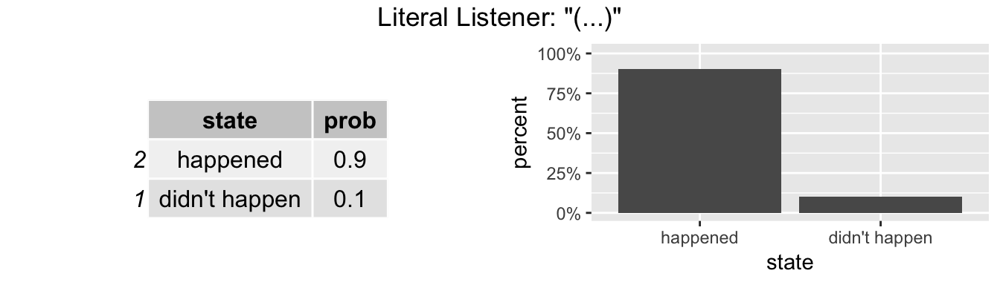<!-- --><!-- --><!-- --><!-- -->

---

As expected, if the activity *happened*, **speakers** preferentially say nothing, and only rarely use high-effort utterances.

<!-- --><!-- -->

---

As would be expected, **pragmatic listeners** infer that if an activity went unmentioned, it is slightly more likely (compared to baseline) to not have happened, given that the speaker has multiple viable alternatives to clearly communicate that it *did* happen.  However, they still overwhelmingly conclude that it is far more likely that the activity occurred, than that it did not.

<!-- --><!-- --><!-- -->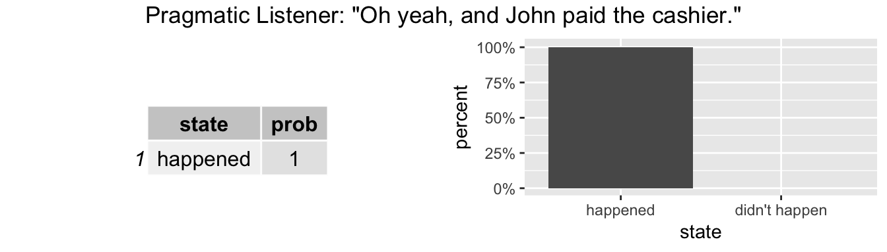<!-- -->

Overall, although this model behaves as expected, it does not tell us anything interesting, and we find out nothing about how *habituality* estimates might change as a result of hearing the utterance.  The slightly lowered likelihood of the activity having occurred, in the case of the "*(...)*" utterance "heard" by pragmatic listeners, does however hint at small changes in *habituality* estimates, based on the utterance that the speaker chose.

## hRSA

**Utterance:** $u$ (the particular utterance)  
**Current activity state:** $s$ (did the activity occur)  
**Habituality:** $h$ (the likelihood of the activity occurring at any particular instance, in the context of the script it belongs to)  

A standard RSA model which incorporates joint reasoning [e.g., @Degen2015;@Goodman2016] can model both changes in beliefs about the world, and changes in beliefs about the current activity state.  Listeners can explicitly reason about the joint likelihood of a given habituality ($h$), and a given activity state ($s$), given a particular utterance ($u$):

* $P_{L_0}(s|u,h) \propto [\![u]\!] (s) \cdot P(s|h)$
* $P_{S_1}(u|s,h) \propto \exp(\alpha (\log P_{L_0}(s|u,h)) - c(u))$
* $P_{L_1}(s,h|u) \propto P_{S_1}(u|s,h) \cdot P(s|h) \cdot P(h)$

The literal listener does not reason about activity *habituality*, as this is not a part of the literal interpretation.

Here, we can feed our empirical priors directly into the model, where the likelihood of the activity occurring is conditional on the *habituality*.  Whether a given activity occurred, or not ($s$), then, is simply a Bernoulli trial with $p=h$.


```js
var beta_high_a = 2.19602561493963
var beta_high_b = 0.410857186535822
var beta_low_a =  0.59051473988806 // estimate from wonky context - predictable activity
var beta_low_b =  0.599422405762914 // estimate from wonky context - predictable activity

// Is this a high-habit activity (paying the cashier when shopping) or a
// low-habit activity (bying apples, paying cashier as habitual non-payer)?
// (mostly for demonstration)
var activity = ["low-habit","high-habit"]

// Assume uniform likelihood
var activityPrior = function() {
  categorical([0.5, 0.5], activity)
}

// Habituality priors
// beta distributions fit to empirical priors
var habitualityPrior = function(activity) {
  activity === "high-habit" ? sample(Beta({a: beta_high_a, b: beta_high_b})) :
  activity === "low-habit" ? sample(Beta({a: beta_low_a, b: beta_low_b})) :
  true
}

// Current activity state
// the activity being described at this point in time either took place, or didn't
var state = ["happened","didn't happen"]

// State priors
// whether the activity took place is dependent on prior likelihood
var statePrior = function(habituality) {
  flip(habituality) ? state[0] : state[1]
}

// Utterances
// choice of 4 utterances; prosody not modeled separately as affects only one variant
var utterance = ['oh yeah','exclamation','plain','(...)']

// Utterance cost
// (rough estimate of number of constituents + extra for articulatory effort)
var cost = {
  "oh yeah": 5,
  "exclamation": 4,
  "plain": 3,
  "(...)": 0
}

// Meaning
// literal meaning of all overt utterances is that activity happened.
// literal meaning of null "utterance" is consistent with all activity states
var meaning = function(utt,state) {
  utt === "oh yeah" ? state === "happened" : 
  utt === "exclamation" ? state === "happened" : 
  utt === "plain" ? state === "happened" : 
  utt === "(...)" ? true :
  true
}

// Speaker optimality
var alpha = 20

// Utterance prior
// utterance prior determined by utterance cost, as defined above
var utterancePrior = function() {
  var uttProbs = map(function(u) {return Math.exp(-cost[u]) }, utterance)
  return categorical(uttProbs, utterance)
}

// Literal listener
var literalListener = mem(function(utterance, habituality) {
  return Infer({model: function() {
    var state = statePrior(habituality)
    condition(meaning(utterance,state))
    return state
  }})
})

// Speaker
var speaker = mem(function(state, habituality) {
  return Infer({model: function() {
    var utterance = utterancePrior()
    factor(alpha * literalListener(utterance, habituality).score(state))
    return utterance
  }})
})

// Pragmatic listener
// assume high-habit activity for demonstration
var pragmaticListener = function(utterance, info) {
  return Infer({method: "rejection", samples: 5000, model: function() {
    var activity = "high-habit"
    var habituality = habitualityPrior(activity)
    var state = statePrior(habituality)
    observe(speaker(state, habituality),utterance)
    info === "both" ? {state: state, habituality: habituality} :
    info === "state" ? state :
    info === "habituality" ? habituality :
    true
  }})
}


// literalListener("(...)",0.95)
// literalListener("(...)",0.5)
// literalListener("(...)",0.05)

// speaker("happened",0.95)
// speaker("happened",0.5)
// speaker("happened",0.05)

// pragmaticListener("(...)","both")
// pragmaticListener("plain","both")
// pragmaticListener("exclamation","both")
// pragmaticListener("oh yeah","both")
```

### Results

Here, one can see that the **literal listener** interprets highly habitual activities as having almost certainly occurred, moderately habitual activities as having perhaps occurred, and non-habitual activities as having almost certainly not occurred.

<!-- -->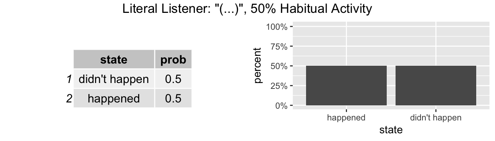<!-- --><!-- -->

---

The **speaker** is most likely not to describe a highly habitual activity explicitly, as expected, and to particularly disprefer relatively effortful utterances.

In the case of moderately habitual activities, the speaker is far more likely to describe the activity explicitly, preferring the least effortful overt utterance.  To note, for moderately predictable activities, it's unclear how frequently we should really expect for the activity be mentioned overtly.

In the case of very unhabitual activities, the speaker most often describes the activity explicitly, again preferring the least effortful utterance.  Of note here is that this model does *not* capture the intuition that speakers should choose more effortful utterances for particularly unhabitual activities.

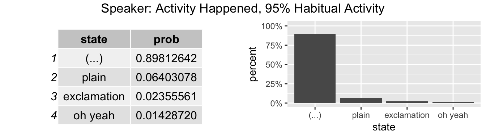<!-- --><!-- -->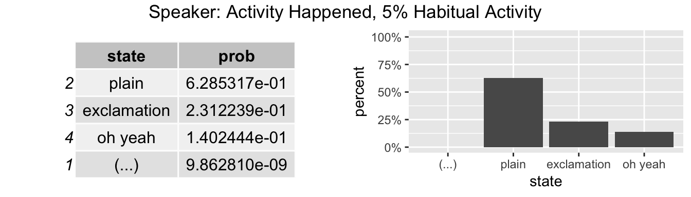<!-- -->

---

The **pragmatic listener** interprets unmentioned (high-habituality) activities as highly habitual, as would be expected.

Explicitly mentioned activities are all roughly equally interpreted as relatively unhabitual, contrary to predictions that more effortful utterances should be perceived as relatively less habitual.

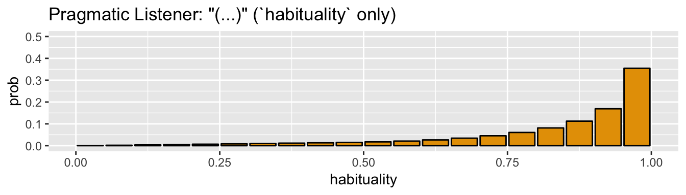<!-- -->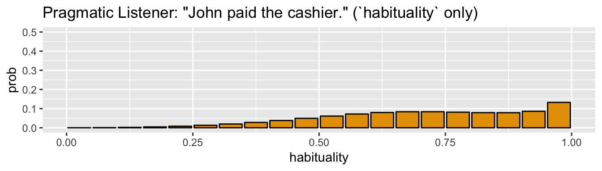<!-- --><!-- -->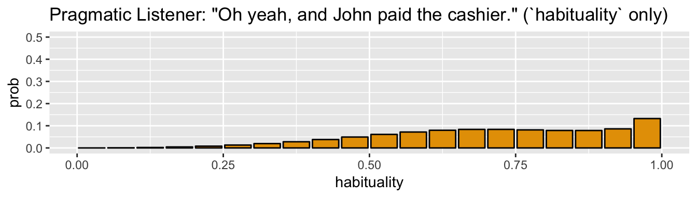<!-- -->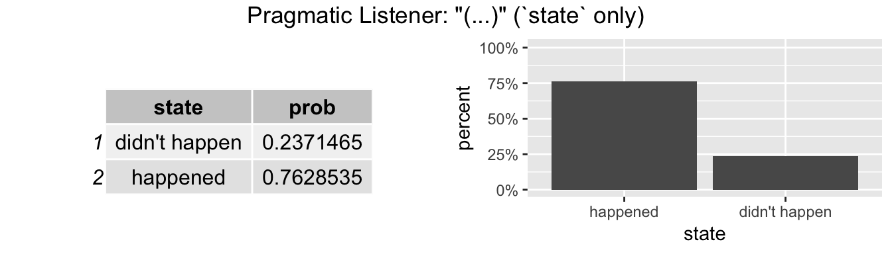<!-- --><!-- --><!-- --><!-- -->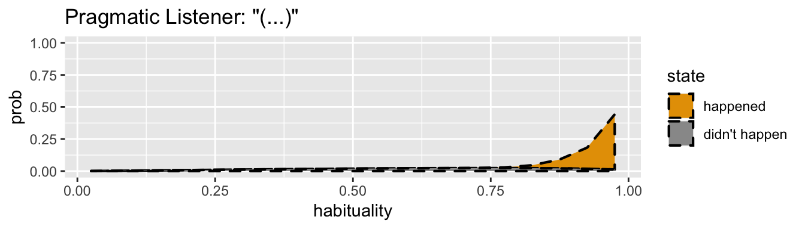<!-- --><!-- -->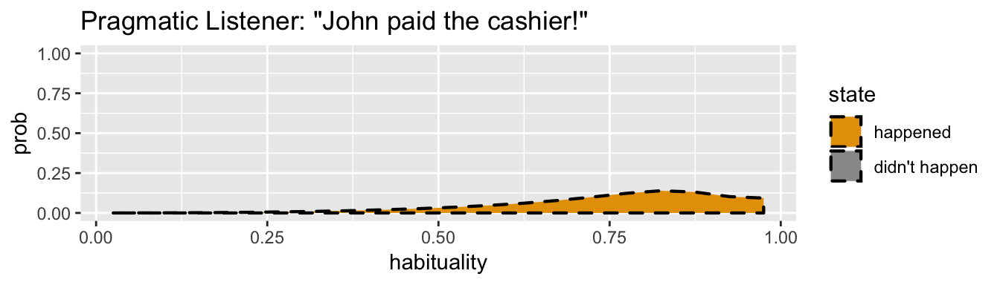<!-- --><!-- -->

This model correctly captures predicted effect (a): if an activity is described explicitly, the *habituality* is likely to be relatively low.  Its shortcoming, however, is that there is no possibility of simply leveraging utterance costs to capture effects (b) and (c) above.

There are three possible ways, in this model, of describing an activity explicitly: "plain"; with exclamatory prosody; and with a discourse marker signifying the utterance's relevance to the discourse/listener -- with the latter two more costly.  The two more attentionally prominent utterances will never be of any advantage to the literal listener, in terms of effectively communicating the current world state.  Likewise they are of no advantage to the speaker, either in terms of likelihood of accurate message transmission to the listener, or the speaker's presumed goal to conserve articulatory effort.  As a consequence, the pragmatic listener will not infer that the more effortful utterances are used in particularly unusual circumstances, compared to the "plain" utterance.

## Noisy channel hRSA

**Utterance (Intended):** $u_i$ (the particular utterance uttered by the speaker)  
**Utterance (Recalled):** $u_r$ (the utterance that the listener actually recalls)  
**Current activity state:** $s$ (did the activity occur)  
**Habituality:** $h$ (the likelihood of the activity occurring)  

Standard RSA models are unable to derive pragmatic inferences of different strengths, given semantically meaning-equivalent utterances, as mathematically proven by @BergenLevy2016. Simply assigning different costs to identically meaningful utterances, for instance, will not allow one to capture the intuitive effects of increased effort, or likelihood of accurate message transmission, on utterance choice or listener comprehension.  Standard RSA models therefore cannot model the effect that increased utterance prominence may have on utterance choice or comprehension.

In order to capture effects (b) and (c) above (stronger inferences for more effortful utterances; more effortful utterances for unusual meanings), it is necessary to assign some communicative benefit to the more costly utterances, in terms of grabbing attention and/or facilitating recall, already active at the literal listener level.  It is in fact plausible that comprehenders cannot accurately recall whether an activity has been explicitly mentioned, or not, as it has been shown that readers often cannot recall whether or not elements in a stereotyped activity sequence were explicitly mentioned [@Bower1979].  Further, informational redundancy, even at the multi-word level, in part has the purpose of ensuring that listeners attend to and accurately recall relevant information, implying that neither is guaranteed [@Walker1993;@Baker2008].

The noisy channel RSA model proposed by @Bergen2015, with fairly minimal modification, successfully captures this intuition, although in this case we consider the likelihood that an utterance is attended to and stored in memory, rather than simply misheard:

* $P_{L_0}(s|u_r,h) \propto [\![u_r ]\!] (s) \cdot P(s|h) \cdot \sum\limits_{u_i: [\![u_i ]\!] (s) = 1} P(u_i)P(u_r|u_i)$
* $P_{S_1}(u_i|s,h) \propto \exp(\alpha (\sum\limits_{u_r}P(u_r|u_i)\log P_{L_0}(s|u_r,h)) - c(u_i))$
* $P_{L_1}(s,h|u_r) \propto P(s|h) \cdot P(h) \cdot \sum\limits_{u_i}P_{S_1}(u_i|s,h)P(u_r|u_i)$

In this model, it's assumed that every utterance has a non-trivial likelihood of not being actively attended to, and being mistaken for or mis-recalled as something akin to its "perceptual neighbors" (as well as a very small chance of being mis-recalled as a non-neighboring utterance).  The "plain" utterance is considered to be perceptually neighboring to the two more effortful utterances, which are further moderately perceptually neighboring to each other.  The "null" utterance is relatively perceptually neighboring to the "plain" utterance, although this relationship is possibly asymmetrical, as comprehenders may be more likely to misremember highly typical activities as having been mentioned, than the other way around (this is, however, not critical for the functioning of this model).

It is, however, also possible that this machinery needs to be further modified to account for the fact that these utterances are only very loosely "neighbors," and misperceiving a signal as something substantially different than what it is is somewhat less likely when talking about complex multi-word utterances.


Below is the `webppl` code for this model, which can be run either on [webppl.org](https://webppl.org), or locally.


```js
var beta_high_a = 2.19602561493963
var beta_high_b = 0.410857186535822
var beta_low_a =  0.59051473988806 // estimate from wonky context - predictable activity
var beta_low_b =  0.599422405762914 // estimate from wonky context - predictable activity

// Is this a high-habit activity (paying the cashier when shopping) or a
// low-habit activity (bying apples, paying cashier as habitual non-payer)?
// (mostly for demonstration)
var activity = ["low-habit","high-habit"]

// Assume uniform likelihood
var activityPrior = function() {
  categorical([0.5, 0.5], activity)
}

// Habituality priors
// beta distributions fit to empirical priors
var habitualityPrior = function(activity) {
  activity === "high-habit" ? sample(Beta({a: beta_high_a, b: beta_high_b})) :
  activity === "low-habit" ? sample(Beta({a: beta_low_a, b: beta_low_b})) :
  true
}

// Current activity state
// the activity being described at this point in time either took place, or didn't
var state = ["happened","didn't happen"]

// State priors
// whether the activity took place is dependent on prior likelihood
var statePrior = function(habituality) {
  flip(habituality) ? state[0] : state[1]
}

// Utterances (intended)
// choice of 4 utterances; prosody not modeled separately as affects only one variant
var utterance_i = ['oh yeah','exclamation','plain','(...)']

// Utterance cost
// (rough estimate of number of constituents + extra for articulatory effort)
var cost = {
  "oh yeah": 5,
  "exclamation": 4,
  "plain": 3,
  "(...)": 0
}

// Utterances (recalled/attended to)
// assume that utterance most likely to be recalled as itself, but also has
// non-trivial likelihood of being recalled as 'neighboring' utterance
// (with markers for plain utterance; vice versa; no utterance for "plain"
// utterance; and vice versa).
// alternately, this can be conceptualized as listener's belief of what the speaker
// *intended* to say - but unclear if below is best way to represent that
var utterance_r = function(utterance) {
  utterance === "oh yeah" ? categorical([0.9,0.05,0.1,0.0001], utterance_i) :
  utterance === "exclamation" ? categorical([0.05,0.9,0.1,0.0001], utterance_i) :
  utterance === "plain" ? categorical([0.1,0.1,0.9,0.05], utterance_i) :
  utterance === "(...)" ? categorical([0.0001,0.0001,0.1,0.9], utterance_i) :
  true
}

// Meaning
// literal meaning of all overt utterances is that activity happened.
// literal meaning of null "utterance" is consistent with all activity states
var meaning = function(utt,state) {
  utt === "oh yeah" ? state === "happened" : 
  utt === "exclamation" ? state === "happened" : 
  utt === "plain" ? state === "happened" : 
  utt === "(...)" ? true :
  true
}

// Speaker optimality
var alpha = 20

// Utterance prior
// utterance prior determined by utterance cost, as defined above
var utterancePrior = function() {
  var uttProbs = map(function(u) {return Math.exp(-cost[u]) }, utterance_i)
  return categorical(uttProbs, utterance_i)
}

// Literal listener
var literalListener = mem(function(utterance, habituality) {
  return Infer({model: function() {
    var state = statePrior(habituality)
    var recalled = utterance_r(utterance)
    condition(meaning(recalled,state))
    return state
  }})
})

// Speaker
var speaker = mem(function(state, habituality) {
  return Infer({model: function() {
    var utterance = utterancePrior()
    var recalled = utterance_r(utterance)
    factor(alpha * literalListener(recalled, habituality).score(state))
    return utterance
  }})
})

// Pragmatic listener
// assume high-habit activity for demonstration
var pragmaticListener = function(utterance, info) {
  return Infer({method: "rejection", samples: 5000, model: function() {
    var activity = "high-habit"
    var habituality = habitualityPrior(activity)
    var state = statePrior(habituality)
    var recalled = utterance_r(utterance)
    observe(speaker(state, habituality),recalled)
    info === "both" ? {state: state, habituality: habituality} :
    info === "state" ? state :
    info === "habituality" ? habituality :
    true
  }})
}


// literalListener("(...)",0.95)
// literalListener("(...)",0.5)
// literalListener("(...)",0.05)

// speaker("happened",0.95)
// speaker("happened",0.5)
// speaker("happened",0.05)

// pragmaticListener("(...)","both")
// pragmaticListener("plain","both")
// pragmaticListener("exclamation","both")
// pragmaticListener("oh yeah","both")
```

### Results

The literal listener, as expected, perceives highly habitual activities as having most likely happened, and so forth.  As can be seen below, they are slightly more biased towards assuming that the activity occurred than that it did not, given the *habituality* of the activity.  This is due to a relatively elevated likelihood that an utterance will be recalled as having been mentioned - it is unclear right now if this is justified, or whether the model will need to be altered.

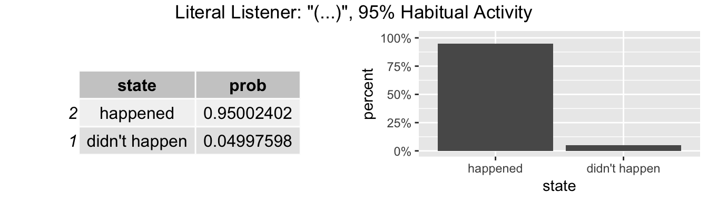<!-- -->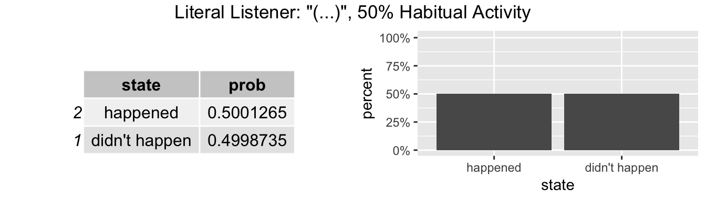<!-- --><!-- -->

----

For high-habituality activities, as before, speakers are very unlikely to describe the activity explicitly - and if they do, they tend towards less effortful utterances.

Moderately habitual activities are only moderately likely to be mentioned, and again speakers gravitate towards less effortful utterances.  This is consistent with expectations, as moderately predictable activities are less likely to be assumed to have not occurred - it is therefore not quite as important to grab the listener's attention to ensure that they do, in fact, understand that the activity took place.

Non-habitual activities are virtually always described explicitly, and as can be seen, speakers prefer a higher-effort utterance that is more likely to be attended to, and less likely to be misrecalled as a "null" utterance.  This matches our predicted effect (c).

<!-- -->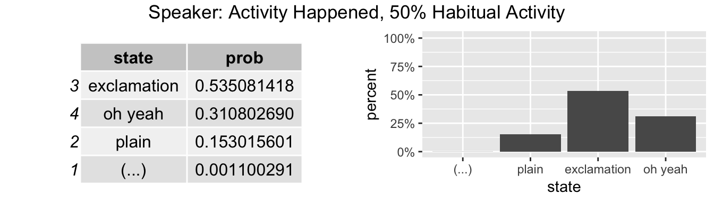<!-- -->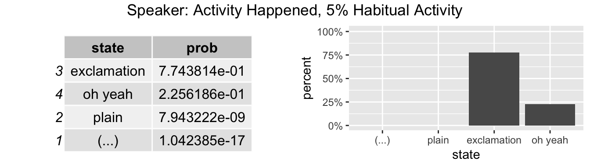<!-- -->

----

As can be seen here, pragmatic listeners perceive activities described overtly as less habitual, and furthermore, perceive activities described with higher-effort utterances as (slightly) less habitual than those described with the lower-effort utterance, matching predicted effects (a) and (b).

Further, the lowest-effort overt "plain" utterance is slightly likely to be remembered as not having been uttered, with far smaller small chance of the same for higher-effort utterances.

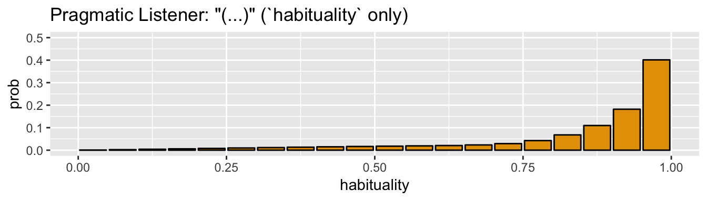<!-- -->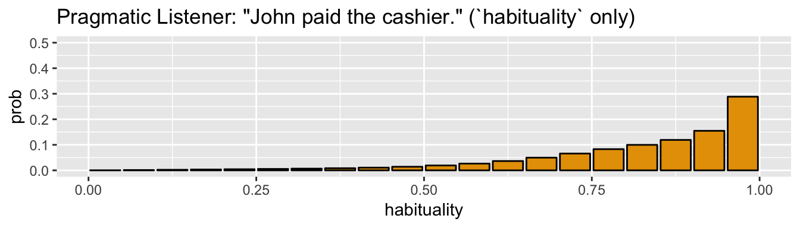<!-- -->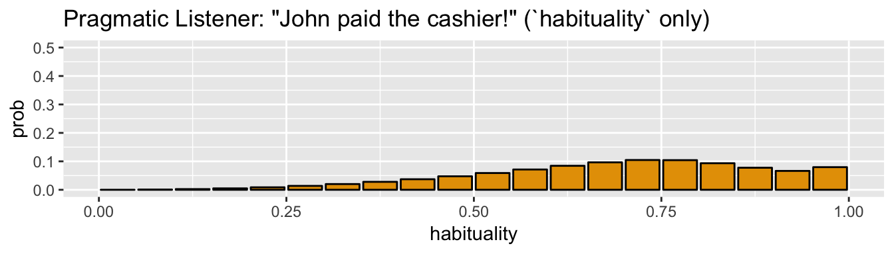<!-- -->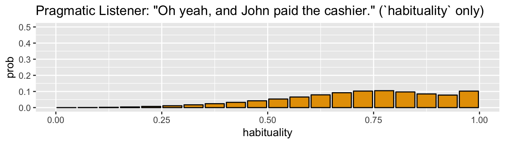<!-- -->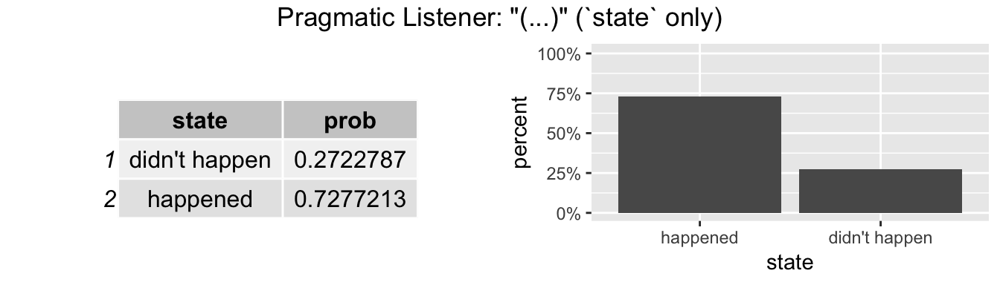<!-- -->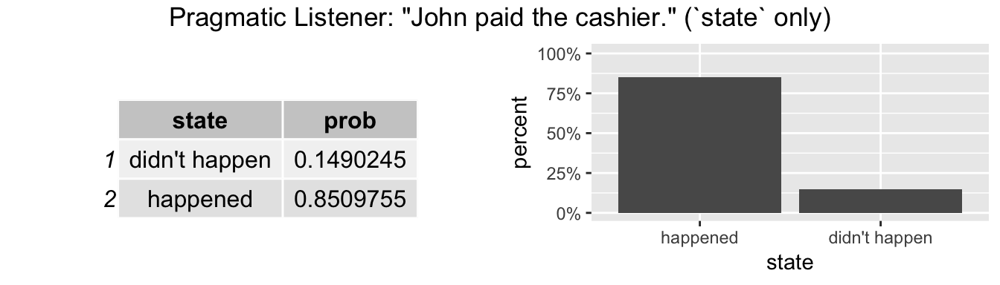<!-- -->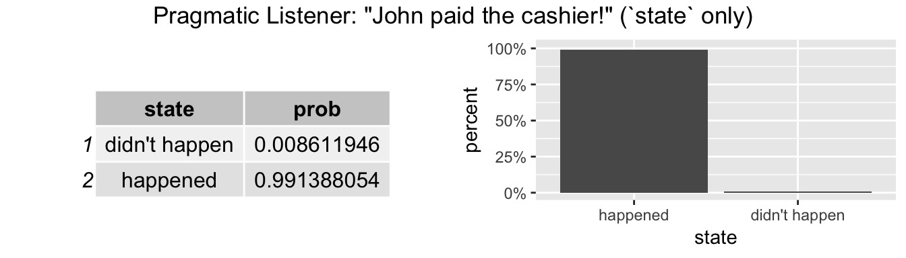<!-- --><!-- --><!-- --><!-- -->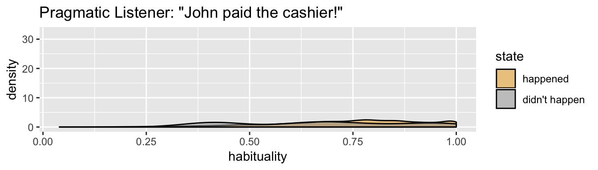<!-- -->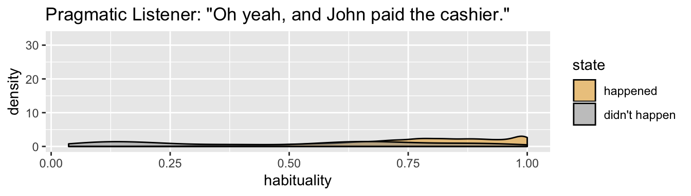<!-- -->

Overall, this model qualitatively captures all of our predicted (including two of our empirically validated) effects, using machinery that has been established in RSA models of other pragmatic phenomena.

## Comparison to empirical results

Overall, the results of the noisy channel hRSA model are a fairly close match, qualitatively, to those empirically measured in our experiments.  To demonstrate this, the primary results of interest are plotted side-by-side below.  Currently the "cashier-paying" habituality ratings in the "*typical context - unpredictable activity*" ("*He got some apples!*") condition are used as a comparison for the predicted "null" utterance interpretation, but this measure will likely be replaced by a measure of activity habituality estimates collected following an utterance that mentions (for example) *shopping*, but does not talk about the activity in question (or any other activity, *shopping* aside, that might imply *paying*).

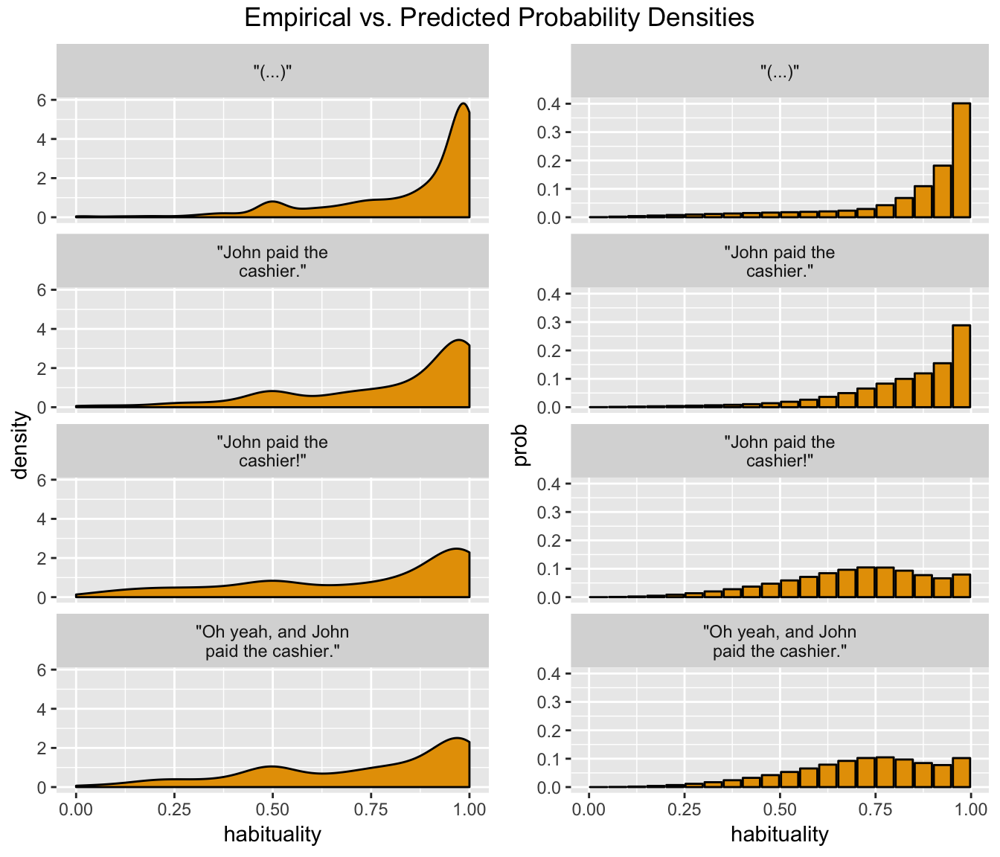<!-- -->

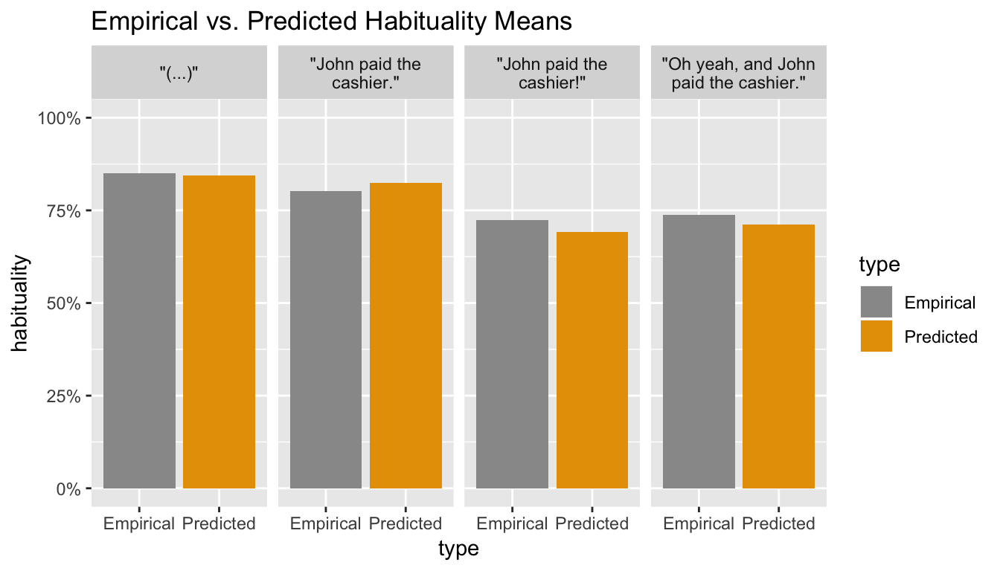<!-- -->


The distributions tails in the empirical data are fatter, and there is a hint of bimodality around the 50% mark.  Otherwise, qualitatively the *habituality* densities match up fairly well, and the mean habitualities are qualitatively and numerically similar.

At this time it is likely, however, that model machinery will need to be altered, or parameters adjusted.  Currently, this model stands primarily as proof of concept that it is possible to generate these inferences, and to generate stronger inferences for more effortful utterances, using established RSA machinery.

----
