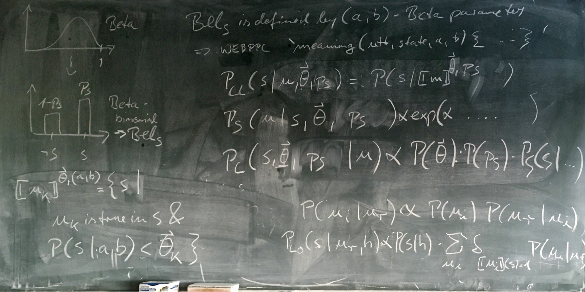

```{r setup, include=FALSE, message=FALSE, warning=FALSE}
knitr::opts_chunk$set(echo = TRUE)
library(rwebppl)
library(tidyverse)
library(fitdistrplus)
library(gridExtra)
library(scales)
library(grid)

data <- read_csv("data/before_after_ratings.csv") %>% mutate_at(vars(id,story:experiment,Qtype,condition:eligible), factor) %>% filter(eligible=="True")

prior_ratings <- data %>% filter(condition=="before" & Qtype %in% c("predictable","unpredictable") & world %in% c("typical","wonky"))

prior_typ_pred <- prior_ratings %>% filter(world=="typical" & Qtype=="predictable")
prior_wonk_pred <- prior_ratings %>% filter(world=="wonky" & Qtype=="predictable")
prior_typ_unpred <- prior_ratings %>% filter(world=="typical" & Qtype=="unpredictable")
prior_wonk_unpred <- prior_ratings %>% filter(world=="wonky" & Qtype=="unpredictable")

posterior_ratings <- data %>% filter(condition=="after" & as.character(Qtype) == as.character(activity) & world %in% c("typical","wonky"))

posterior_typ_pred <- posterior_ratings %>% filter(world=="typical" & activity=="predictable")
posterior_wonk_pred <- posterior_ratings %>% filter(world=="wonky" & activity=="predictable")
posterior_typ_unpred <- posterior_ratings %>% filter(world=="typical" & activity=="unpredictable")
posterior_wonk_unpred <- posterior_ratings %>% filter(world=="wonky" & activity=="unpredictable")

posterior_typ_pred_empty <- data %>% filter(condition=="after" & Qtype == "predictable" & world == "typical" & activity=="unpredictable")

posterior_wonk_pred_empty <- data %>% filter(condition=="after" & Qtype == "predictable" & world == "wonky" & activity=="unpredictable")

########

scale_ratings <- function(rating) {
  (rating/100 - min(rating/100) + 0.001) / (max(rating/100) - min(rating/100) + 0.002)
}

dist_one <- function(result,title) {
  ggplot(result, aes(x=habituality)) + geom_density(fill="#E69F00") + ylim(0,15) + ggtitle(title)
}

dist_both <- function(result,title,levels) {
  result$state <- factor(result$state, levels=levels)
  ggplot(result, aes(x=habituality, fill=state)) + geom_density(alpha=0.5) + scale_fill_manual(values=c("#E69F00", "#999999", "#56B4E9"), drop=FALSE) + ylim(0,32.5) + ggtitle(title)
}

results <- function(result, title, levels) {
  result <- rename(result, state=support)
  table <- tableGrob(result)
  result$state <- factor(result$state, levels=levels)
  plot <- ggplot(result, aes(x=state, y=prob)) +   geom_bar(stat="identity") + scale_y_continuous(labels=percent, name="percent", limits = c(0,1)) + scale_x_discrete(drop=FALSE)
  grid.arrange(top=textGrob(title, gp=gpar(fontsize=13.2)), table, plot, ncol=2)
}

prob_state <- function(result) {
  result %>% dplyr::select(support = state) %>% group_by(support) %>% tally() %>% mutate(prob = n / sum(n)) %>% dplyr::select(support,prob)
}

prob_habit <- function(result) {
  result %>% dplyr::select(habituality)
}

prob_both <- function(result) {
  result %>% spread(Parameter, value) %>% dplyr::select(-Iteration, -Chain) %>% mutate_at("habituality", as.numeric)
}
```

```{r typ pred fit, echo=FALSE}
# scale to remove 0 and 1 values (add/subtract 0.001 from edges)
prior_typ_pred_scaled <- scale_ratings(prior_typ_pred$rating)

# fit beta distribution by maximum likelihood estimation
fit.prior_typ_pred <- fitdist(prior_typ_pred_scaled, "beta", method="mle")
```
```{r typ pred summary, echo=FALSE}
js.prior_pred <- paste0("var beta_high_a = ",fit.prior_typ_pred$estimate[1],"\n","var beta_high_b = ",fit.prior_typ_pred$estimate[2],"\n","var beta_low_a = 0.59051473988806","\n","var beta_low_b = 0.599422405762914","\n")
```

## Formulas fixed; add utterance posterior

* $P_{L_0}(s|u_r,h) \propto P(s|h) \cdot \sum\limits_{u_i: [\![u_i ]\!] (s) = 1} P(u_r|u_i)P(u_i)$
* $P_{S_1}(u_i|s,h;\alpha,C) \propto P(u_i;C)\exp(\alpha \sum\limits_{u_r}P(u_r|u_i)\log P_{L_0}(s|u_r,h))$
* $P_{L_1}(s,h|u_r) \propto P(s|h) \cdot P(h) \cdot \sum\limits_{u_i}P_{S_1}(u_i|s,h;\alpha,C)P(u_r|u_i)P(u_i)$

```{r base model, echo=FALSE}
base_model <- paste0(js.prior_pred, "\nvar world_type = \"ordinary\"\n\n", paste(readLines("models/noisy_hrsa_fixed.webppl"), collapse="\n"))
```

```{r noisy hRSA model, echo=FALSE, cache=TRUE}
l0_95 <- webppl(paste(base_model, "literalListener(\"(...)\",0.95)", sep="\n"))
l0_50 <- webppl(paste(base_model, "literalListener(\"(...)\",0.5)", sep="\n"))
l0_5 <- webppl(paste(base_model, "literalListener(\"(...)\",0.05)", sep="\n"))

s_95 <- webppl(paste(base_model, "speaker(\"happened\",0.95)", sep="\n"))
s_50 <- webppl(paste(base_model, "speaker(\"happened\",0.5)", sep="\n"))
s_5 <- webppl(paste(base_model, "speaker(\"happened\",0.05)", sep="\n"))

l1_empty <- prob_both(as_tibble(webppl(paste(base_model, "pragmaticListener(\"(...)\",\"both\")", sep="\n"))))
l1_plain <- prob_both(as_tibble(webppl(paste(base_model, "pragmaticListener(\"plain\",\"both\")", sep="\n"))))
l1_exclamation <- prob_both(as_tibble(webppl(paste(base_model, "pragmaticListener(\"exclamation\",\"both\")", sep="\n"))))
l1_ohyeah <- prob_both(as_tibble(webppl(paste(base_model, "pragmaticListener(\"oh yeah\",\"both\")", sep="\n"))))

l1_empty_habit <- prob_habit(l1_empty)
l1_plain_habit <- prob_habit(l1_plain)
l1_exclamation_habit <- prob_habit(l1_exclamation)
l1_ohyeah_habit <- prob_habit(l1_ohyeah)

l1_empty_state <- prob_state(l1_empty)
l1_plain_state <- prob_state(l1_plain)
l1_exclamation_state <- prob_state(l1_exclamation)
l1_ohyeah_state <- prob_state(l1_ohyeah)
```

```{js noisy hRSA code, eval=FALSE, code=base_model}
```

### Results

#### Literal listener

```{r noisy hRSA plots 1, fig.height = 2, echo=FALSE}
utterances <- c("(...)","plain","exclamation","oh yeah")
states <- c("happened","didn't happen")

results(l0_95,"Literal Listener: \"(...)\", 95% Habitual Activity", states)
results(l0_50,"Literal Listener: \"(...)\", 50% Habitual Activity", states)
results(l0_5,"Literal Listener: \"(...)\", 5% Habitual Activity", states)
```

#### Speaker

```{r noisy hRSA plots 2, fig.height = 2, echo=FALSE}
results(s_95,"Speaker: Activity Happened, 95% Habitual Activity", utterances)
results(s_50,"Speaker: Activity Happened, 50% Habitual Activity", utterances)
results(s_5,"Speaker: Activity Happened, 5% Habitual Activity", utterances)
```

#### Pragmatic listener

```{r noisy hRSA plots 3, fig.height = 2, echo=FALSE}
dist_one(l1_empty_habit,"Pragmatic Listener: \"(...)\" (`habituality` only)")
dist_one(l1_plain_habit,"Pragmatic Listener: \"John paid the cashier.\" (`habituality` only)")
dist_one(l1_exclamation_habit,"Pragmatic Listener: \"John paid the cashier!\" (`habituality` only)")
dist_one(l1_ohyeah_habit,"Pragmatic Listener: \"Oh yeah, and John paid the cashier.\" (`habituality` only)")

results(l1_empty_state,"Pragmatic Listener: \"(...)\" (`state` only)", states)
results(l1_plain_state,"Pragmatic Listener: \"John paid the cashier.\" (`state` only)", states)
results(l1_exclamation_state,"Pragmatic Listener: \"John paid the cashier!\" (`state` only)", states)
results(l1_ohyeah_state,"Pragmatic Listener: \"Oh yeah, and John paid the cashier.\" (`state` only)", states)

# dist_both(l1_empty,"Pragmatic Listener: \"(...)\"", states)
# dist_both(l1_plain,"Pragmatic Listener: \"John paid the cashier.\"", states)
# dist_both(l1_exclamation,"Pragmatic Listener: \"John paid the cashier!\"", states)
# dist_both(l1_ohyeah,"Pragmatic Listener: \"Oh yeah, and John paid the cashier.\"", states)
```

### Comparison to empirical results

```{r empirical results 1, fig.height = 6, echo=FALSE}
data_empty <- tibble(rating = posterior_typ_pred_empty$rating/100)
data_plain <- (filter(posterior_typ_pred, experiment=="period") %>% dplyr::select(rating))/100
data_exclamation <- (filter(posterior_typ_pred, experiment=="exclamation") %>% dplyr::select(rating))/100
data_ohyeah <- (filter(posterior_typ_pred, experiment=="ohyeah") %>% dplyr::select(rating))/100

empirical <- nrow(data_empty) + nrow(posterior_typ_pred)
predicted <- nrow(l1_empty_habit)*4

type <- c(rep("Empirical",nrow(data_empty)), rep("Predicted",nrow(l1_empty_habit)), rep("Empirical",nrow(data_plain)), rep("Predicted",nrow(l1_plain_habit)), rep("Empirical",nrow(data_exclamation)), rep("Predicted",nrow(l1_exclamation_habit)), rep("Empirical",nrow(data_ohyeah)), rep("Predicted",nrow(l1_ohyeah_habit)))

experiment <- c(rep("\"(...)\"",nrow(data_empty)+nrow(l1_empty_habit)), rep("\"John paid the\ncashier.\"",nrow(data_plain)+nrow(l1_plain_habit)), rep("\"John paid the\ncashier!\"",nrow(data_exclamation)+nrow(l1_exclamation_habit)), rep("\"Oh yeah, and John\npaid the cashier.\"",nrow(data_ohyeah)+nrow(l1_ohyeah_habit)))

comparison <- tibble(type = type, experiment = experiment, habituality = c(data_empty$rating, l1_empty_habit$habituality,data_plain$rating,l1_plain_habit$habituality,data_exclamation$rating,l1_exclamation_habit$habituality,data_ohyeah$rating,l1_ohyeah_habit$habituality)) %>% mutate_if(is.character, as.factor)

comparison$experiment <- factor(comparison$experiment, levels=c("\"(...)\"","\"John paid the\ncashier.\"","\"John paid the\ncashier!\"","\"Oh yeah, and John\npaid the cashier.\""))

ggplot(comparison, aes(x=habituality)) + geom_density(fill="#E69F00") + facet_grid(experiment ~ type) + ggtitle("Empirical vs. Predicted Probability Densities")
```

```{r empirical results 2, fig.height = 4, echo=FALSE}
comparison %>% group_by(type,experiment) %>% summarize(habituality = mean(habituality)) %>% ggplot(aes(x=type, y=habituality, fill=type)) + geom_bar(stat="identity") + facet_grid(. ~ experiment) + scale_y_continuous(labels = percent_format(), limits = c(0,1)) + scale_fill_manual(values=c("#999999", "#E69F00", "#56B4E9")) + ggtitle("Empirical vs. Predicted Habituality Means")
```

## Fix sums

```{r sums base model, echo=FALSE}
base_model <- paste0(js.prior_pred, "\nvar world_type = \"ordinary\"\n\n", paste(readLines("models/noisy_hrsa_sums.webppl"), collapse="\n"))
```

```{r sums noisy hRSA model, echo=FALSE, cache=TRUE}
l0_95 <- webppl(paste(base_model, "literalListener(\"(...)\",0.95)", sep="\n"))
l0_50 <- webppl(paste(base_model, "literalListener(\"(...)\",0.5)", sep="\n"))
l0_5 <- webppl(paste(base_model, "literalListener(\"(...)\",0.05)", sep="\n"))

s_95 <- webppl(paste(base_model, "speaker(\"happened\",0.95)", sep="\n"))
s_50 <- webppl(paste(base_model, "speaker(\"happened\",0.5)", sep="\n"))
s_5 <- webppl(paste(base_model, "speaker(\"happened\",0.05)", sep="\n"))

l1_empty <- prob_both(as_tibble(webppl(paste(base_model, "pragmaticListener(\"(...)\",\"both\")", sep="\n"))))
l1_plain <- prob_both(as_tibble(webppl(paste(base_model, "pragmaticListener(\"plain\",\"both\")", sep="\n"))))
l1_exclamation <- prob_both(as_tibble(webppl(paste(base_model, "pragmaticListener(\"exclamation\",\"both\")", sep="\n"))))
l1_ohyeah <- prob_both(as_tibble(webppl(paste(base_model, "pragmaticListener(\"oh yeah\",\"both\")", sep="\n"))))

l1_empty_habit <- prob_habit(l1_empty)
l1_plain_habit <- prob_habit(l1_plain)
l1_exclamation_habit <- prob_habit(l1_exclamation)
l1_ohyeah_habit <- prob_habit(l1_ohyeah)

l1_empty_state <- prob_state(l1_empty)
l1_plain_state <- prob_state(l1_plain)
l1_exclamation_state <- prob_state(l1_exclamation)
l1_ohyeah_state <- prob_state(l1_ohyeah)
```

```{js sums noisy hRSA code, eval=FALSE, code=base_model}
```

### Results

#### Literal listener

```{r sums noisy hRSA plots 1, fig.height = 2, echo=FALSE}
utterances <- c("(...)","plain","exclamation","oh yeah")
states <- c("happened","didn't happen")

results(l0_95,"Literal Listener: \"(...)\", 95% Habitual Activity", states)
results(l0_50,"Literal Listener: \"(...)\", 50% Habitual Activity", states)
results(l0_5,"Literal Listener: \"(...)\", 5% Habitual Activity", states)
```

#### Speaker

```{r sums noisy hRSA plots 2, fig.height = 2, echo=FALSE}
results(s_95,"Speaker: Activity Happened, 95% Habitual Activity", utterances)
results(s_50,"Speaker: Activity Happened, 50% Habitual Activity", utterances)
results(s_5,"Speaker: Activity Happened, 5% Habitual Activity", utterances)
```

#### Pragmatic listener

```{r sums noisy hRSA plots 3, fig.height = 2, echo=FALSE}
dist_one(l1_empty_habit,"Pragmatic Listener: \"(...)\" (`habituality` only)")
dist_one(l1_plain_habit,"Pragmatic Listener: \"John paid the cashier.\" (`habituality` only)")
dist_one(l1_exclamation_habit,"Pragmatic Listener: \"John paid the cashier!\" (`habituality` only)")
dist_one(l1_ohyeah_habit,"Pragmatic Listener: \"Oh yeah, and John paid the cashier.\" (`habituality` only)")

results(l1_empty_state,"Pragmatic Listener: \"(...)\" (`state` only)", states)
results(l1_plain_state,"Pragmatic Listener: \"John paid the cashier.\" (`state` only)", states)
results(l1_exclamation_state,"Pragmatic Listener: \"John paid the cashier!\" (`state` only)", states)
results(l1_ohyeah_state,"Pragmatic Listener: \"Oh yeah, and John paid the cashier.\" (`state` only)", states)

# dist_both(l1_empty,"Pragmatic Listener: \"(...)\"", states)
# dist_both(l1_plain,"Pragmatic Listener: \"John paid the cashier.\"", states)
# dist_both(l1_exclamation,"Pragmatic Listener: \"John paid the cashier!\"", states)
# dist_both(l1_ohyeah,"Pragmatic Listener: \"Oh yeah, and John paid the cashier.\"", states)
```

### Comparison to empirical results

```{r sums empirical results 1, fig.height = 6, echo=FALSE}
data_empty <- tibble(rating = posterior_typ_pred_empty$rating/100)
data_plain <- (filter(posterior_typ_pred, experiment=="period") %>% dplyr::select(rating))/100
data_exclamation <- (filter(posterior_typ_pred, experiment=="exclamation") %>% dplyr::select(rating))/100
data_ohyeah <- (filter(posterior_typ_pred, experiment=="ohyeah") %>% dplyr::select(rating))/100

empirical <- nrow(data_empty) + nrow(posterior_typ_pred)
predicted <- nrow(l1_empty_habit)*4

type <- c(rep("Empirical",nrow(data_empty)), rep("Predicted",nrow(l1_empty_habit)), rep("Empirical",nrow(data_plain)), rep("Predicted",nrow(l1_plain_habit)), rep("Empirical",nrow(data_exclamation)), rep("Predicted",nrow(l1_exclamation_habit)), rep("Empirical",nrow(data_ohyeah)), rep("Predicted",nrow(l1_ohyeah_habit)))

experiment <- c(rep("\"(...)\"",nrow(data_empty)+nrow(l1_empty_habit)), rep("\"John paid the\ncashier.\"",nrow(data_plain)+nrow(l1_plain_habit)), rep("\"John paid the\ncashier!\"",nrow(data_exclamation)+nrow(l1_exclamation_habit)), rep("\"Oh yeah, and John\npaid the cashier.\"",nrow(data_ohyeah)+nrow(l1_ohyeah_habit)))

comparison <- tibble(type = type, experiment = experiment, habituality = c(data_empty$rating, l1_empty_habit$habituality,data_plain$rating,l1_plain_habit$habituality,data_exclamation$rating,l1_exclamation_habit$habituality,data_ohyeah$rating,l1_ohyeah_habit$habituality)) %>% mutate_if(is.character, as.factor)

comparison$experiment <- factor(comparison$experiment, levels=c("\"(...)\"","\"John paid the\ncashier.\"","\"John paid the\ncashier!\"","\"Oh yeah, and John\npaid the cashier.\""))

ggplot(comparison, aes(x=habituality)) + geom_density(fill="#E69F00") + facet_grid(experiment ~ type) + ggtitle("Empirical vs. Predicted Probability Densities")
```

```{r sums empirical results 2, fig.height = 4, echo=FALSE}
comparison %>% group_by(type,experiment) %>% summarize(habituality = mean(habituality)) %>% ggplot(aes(x=type, y=habituality, fill=type)) + geom_bar(stat="identity") + facet_grid(. ~ experiment) + scale_y_continuous(labels = percent_format(), limits = c(0,1)) + scale_fill_manual(values=c("#999999", "#E69F00", "#56B4E9")) + ggtitle("Empirical vs. Predicted Habituality Means")
```

## "(...)" (almost) can't be misremembered

Setting values in confusion matrix to 0 breaks new model.

```{r null base model, echo=FALSE}
base_model <- paste0(js.prior_pred, "\nvar world_type = \"ordinary\"\n\n", paste(readLines("models/noisy_hrsa_null.webppl"), collapse="\n"))
```

```{r null noisy hRSA model, echo=FALSE, cache=TRUE}
l0_95 <- webppl(paste(base_model, "literalListener(\"(...)\",0.95)", sep="\n"))
l0_50 <- webppl(paste(base_model, "literalListener(\"(...)\",0.5)", sep="\n"))
l0_5 <- webppl(paste(base_model, "literalListener(\"(...)\",0.05)", sep="\n"))

s_95 <- webppl(paste(base_model, "speaker(\"happened\",0.95)", sep="\n"))
s_50 <- webppl(paste(base_model, "speaker(\"happened\",0.5)", sep="\n"))
s_5 <- webppl(paste(base_model, "speaker(\"happened\",0.05)", sep="\n"))

l1_empty <- prob_both(as_tibble(webppl(paste(base_model, "pragmaticListener(\"(...)\",\"both\")", sep="\n"))))
l1_plain <- prob_both(as_tibble(webppl(paste(base_model, "pragmaticListener(\"plain\",\"both\")", sep="\n"))))
l1_exclamation <- prob_both(as_tibble(webppl(paste(base_model, "pragmaticListener(\"exclamation\",\"both\")", sep="\n"))))
l1_ohyeah <- prob_both(as_tibble(webppl(paste(base_model, "pragmaticListener(\"oh yeah\",\"both\")", sep="\n"))))

l1_empty_habit <- prob_habit(l1_empty)
l1_plain_habit <- prob_habit(l1_plain)
l1_exclamation_habit <- prob_habit(l1_exclamation)
l1_ohyeah_habit <- prob_habit(l1_ohyeah)

l1_empty_state <- prob_state(l1_empty)
l1_plain_state <- prob_state(l1_plain)
l1_exclamation_state <- prob_state(l1_exclamation)
l1_ohyeah_state <- prob_state(l1_ohyeah)
```

```{js null noisy hRSA code, eval=FALSE, code=base_model}
```

### Results

#### Literal listener

```{r null noisy hRSA plots 1, fig.height = 2, echo=FALSE}
utterances <- c("(...)","plain","exclamation","oh yeah")
states <- c("happened","didn't happen")

results(l0_95,"Literal Listener: \"(...)\", 95% Habitual Activity", states)
results(l0_50,"Literal Listener: \"(...)\", 50% Habitual Activity", states)
results(l0_5,"Literal Listener: \"(...)\", 5% Habitual Activity", states)
```

#### Speaker

```{r null noisy hRSA plots 2, fig.height = 2, echo=FALSE}
results(s_95,"Speaker: Activity Happened, 95% Habitual Activity", utterances)
results(s_50,"Speaker: Activity Happened, 50% Habitual Activity", utterances)
results(s_5,"Speaker: Activity Happened, 5% Habitual Activity", utterances)
```

#### Pragmatic listener

```{r null noisy hRSA plots 3, fig.height = 2, echo=FALSE}
dist_one(l1_empty_habit,"Pragmatic Listener: \"(...)\" (`habituality` only)")
dist_one(l1_plain_habit,"Pragmatic Listener: \"John paid the cashier.\" (`habituality` only)")
dist_one(l1_exclamation_habit,"Pragmatic Listener: \"John paid the cashier!\" (`habituality` only)")
dist_one(l1_ohyeah_habit,"Pragmatic Listener: \"Oh yeah, and John paid the cashier.\" (`habituality` only)")

results(l1_empty_state,"Pragmatic Listener: \"(...)\" (`state` only)", states)
results(l1_plain_state,"Pragmatic Listener: \"John paid the cashier.\" (`state` only)", states)
results(l1_exclamation_state,"Pragmatic Listener: \"John paid the cashier!\" (`state` only)", states)
results(l1_ohyeah_state,"Pragmatic Listener: \"Oh yeah, and John paid the cashier.\" (`state` only)", states)

# dist_both(l1_empty,"Pragmatic Listener: \"(...)\"", states)
# dist_both(l1_plain,"Pragmatic Listener: \"John paid the cashier.\"", states)
# dist_both(l1_exclamation,"Pragmatic Listener: \"John paid the cashier!\"", states)
# dist_both(l1_ohyeah,"Pragmatic Listener: \"Oh yeah, and John paid the cashier.\"", states)
```

### Comparison to empirical results

```{r null empirical results 1, fig.height = 6, echo=FALSE}
data_empty <- tibble(rating = posterior_typ_pred_empty$rating/100)
data_plain <- (filter(posterior_typ_pred, experiment=="period") %>% dplyr::select(rating))/100
data_exclamation <- (filter(posterior_typ_pred, experiment=="exclamation") %>% dplyr::select(rating))/100
data_ohyeah <- (filter(posterior_typ_pred, experiment=="ohyeah") %>% dplyr::select(rating))/100

empirical <- nrow(data_empty) + nrow(posterior_typ_pred)
predicted <- nrow(l1_empty_habit)*4

type <- c(rep("Empirical",nrow(data_empty)), rep("Predicted",nrow(l1_empty_habit)), rep("Empirical",nrow(data_plain)), rep("Predicted",nrow(l1_plain_habit)), rep("Empirical",nrow(data_exclamation)), rep("Predicted",nrow(l1_exclamation_habit)), rep("Empirical",nrow(data_ohyeah)), rep("Predicted",nrow(l1_ohyeah_habit)))

experiment <- c(rep("\"(...)\"",nrow(data_empty)+nrow(l1_empty_habit)), rep("\"John paid the\ncashier.\"",nrow(data_plain)+nrow(l1_plain_habit)), rep("\"John paid the\ncashier!\"",nrow(data_exclamation)+nrow(l1_exclamation_habit)), rep("\"Oh yeah, and John\npaid the cashier.\"",nrow(data_ohyeah)+nrow(l1_ohyeah_habit)))

comparison <- tibble(type = type, experiment = experiment, habituality = c(data_empty$rating, l1_empty_habit$habituality,data_plain$rating,l1_plain_habit$habituality,data_exclamation$rating,l1_exclamation_habit$habituality,data_ohyeah$rating,l1_ohyeah_habit$habituality)) %>% mutate_if(is.character, as.factor)

comparison$experiment <- factor(comparison$experiment, levels=c("\"(...)\"","\"John paid the\ncashier.\"","\"John paid the\ncashier!\"","\"Oh yeah, and John\npaid the cashier.\""))

ggplot(comparison, aes(x=habituality)) + geom_density(fill="#E69F00") + facet_grid(experiment ~ type) + ggtitle("Empirical vs. Predicted Probability Densities")
```

```{r null empirical results 2, fig.height = 4, echo=FALSE}
comparison %>% group_by(type,experiment) %>% summarize(habituality = mean(habituality)) %>% ggplot(aes(x=type, y=habituality, fill=type)) + geom_bar(stat="identity") + facet_grid(. ~ experiment) + scale_y_continuous(labels = percent_format(), limits = c(0,1)) + scale_fill_manual(values=c("#999999", "#E69F00", "#56B4E9")) + ggtitle("Empirical vs. Predicted Habituality Means")
```


## "(...)" very unlikely to be misremembered

```{r null diff base model, echo=FALSE}
base_model <- paste0(js.prior_pred, "\nvar world_type = \"ordinary\"\n\n", paste(readLines("models/noisy_hrsa_null_diff.webppl"), collapse="\n"))
```

```{r null diff noisy hRSA model, echo=FALSE, cache=TRUE}
l0_95 <- webppl(paste(base_model, "literalListener(\"(...)\",0.95)", sep="\n"))
l0_50 <- webppl(paste(base_model, "literalListener(\"(...)\",0.5)", sep="\n"))
l0_5 <- webppl(paste(base_model, "literalListener(\"(...)\",0.05)", sep="\n"))

s_95 <- webppl(paste(base_model, "speaker(\"happened\",0.95)", sep="\n"))
s_50 <- webppl(paste(base_model, "speaker(\"happened\",0.5)", sep="\n"))
s_5 <- webppl(paste(base_model, "speaker(\"happened\",0.05)", sep="\n"))

l1_empty <- prob_both(as_tibble(webppl(paste(base_model, "pragmaticListener(\"(...)\",\"both\")", sep="\n"))))
l1_plain <- prob_both(as_tibble(webppl(paste(base_model, "pragmaticListener(\"plain\",\"both\")", sep="\n"))))
l1_exclamation <- prob_both(as_tibble(webppl(paste(base_model, "pragmaticListener(\"exclamation\",\"both\")", sep="\n"))))
l1_ohyeah <- prob_both(as_tibble(webppl(paste(base_model, "pragmaticListener(\"oh yeah\",\"both\")", sep="\n"))))

l1_empty_habit <- prob_habit(l1_empty)
l1_plain_habit <- prob_habit(l1_plain)
l1_exclamation_habit <- prob_habit(l1_exclamation)
l1_ohyeah_habit <- prob_habit(l1_ohyeah)

l1_empty_state <- prob_state(l1_empty)
l1_plain_state <- prob_state(l1_plain)
l1_exclamation_state <- prob_state(l1_exclamation)
l1_ohyeah_state <- prob_state(l1_ohyeah)
```

```{js null diff noisy hRSA code, eval=FALSE, code=base_model}
```

### Results

#### Literal listener

```{r null diff noisy hRSA plots 1, fig.height = 2, echo=FALSE}
utterances <- c("(...)","plain","exclamation","oh yeah")
states <- c("happened","didn't happen")

results(l0_95,"Literal Listener: \"(...)\", 95% Habitual Activity", states)
results(l0_50,"Literal Listener: \"(...)\", 50% Habitual Activity", states)
results(l0_5,"Literal Listener: \"(...)\", 5% Habitual Activity", states)
```

#### Speaker

```{r null diff noisy hRSA plots 2, fig.height = 2, echo=FALSE}
results(s_95,"Speaker: Activity Happened, 95% Habitual Activity", utterances)
results(s_50,"Speaker: Activity Happened, 50% Habitual Activity", utterances)
results(s_5,"Speaker: Activity Happened, 5% Habitual Activity", utterances)
```

#### Pragmatic listener

```{r null diff noisy hRSA plots 3, fig.height = 2, echo=FALSE}
dist_one(l1_empty_habit,"Pragmatic Listener: \"(...)\" (`habituality` only)")
dist_one(l1_plain_habit,"Pragmatic Listener: \"John paid the cashier.\" (`habituality` only)")
dist_one(l1_exclamation_habit,"Pragmatic Listener: \"John paid the cashier!\" (`habituality` only)")
dist_one(l1_ohyeah_habit,"Pragmatic Listener: \"Oh yeah, and John paid the cashier.\" (`habituality` only)")

results(l1_empty_state,"Pragmatic Listener: \"(...)\" (`state` only)", states)
results(l1_plain_state,"Pragmatic Listener: \"John paid the cashier.\" (`state` only)", states)
results(l1_exclamation_state,"Pragmatic Listener: \"John paid the cashier!\" (`state` only)", states)
results(l1_ohyeah_state,"Pragmatic Listener: \"Oh yeah, and John paid the cashier.\" (`state` only)", states)

# dist_both(l1_empty,"Pragmatic Listener: \"(...)\"", states)
# dist_both(l1_plain,"Pragmatic Listener: \"John paid the cashier.\"", states)
# dist_both(l1_exclamation,"Pragmatic Listener: \"John paid the cashier!\"", states)
# dist_both(l1_ohyeah,"Pragmatic Listener: \"Oh yeah, and John paid the cashier.\"", states)
```

### Comparison to empirical results

```{r null diff empirical results 1, fig.height = 6, echo=FALSE}
data_empty <- tibble(rating = posterior_typ_pred_empty$rating/100)
data_plain <- (filter(posterior_typ_pred, experiment=="period") %>% dplyr::select(rating))/100
data_exclamation <- (filter(posterior_typ_pred, experiment=="exclamation") %>% dplyr::select(rating))/100
data_ohyeah <- (filter(posterior_typ_pred, experiment=="ohyeah") %>% dplyr::select(rating))/100

empirical <- nrow(data_empty) + nrow(posterior_typ_pred)
predicted <- nrow(l1_empty_habit)*4

type <- c(rep("Empirical",nrow(data_empty)), rep("Predicted",nrow(l1_empty_habit)), rep("Empirical",nrow(data_plain)), rep("Predicted",nrow(l1_plain_habit)), rep("Empirical",nrow(data_exclamation)), rep("Predicted",nrow(l1_exclamation_habit)), rep("Empirical",nrow(data_ohyeah)), rep("Predicted",nrow(l1_ohyeah_habit)))

experiment <- c(rep("\"(...)\"",nrow(data_empty)+nrow(l1_empty_habit)), rep("\"John paid the\ncashier.\"",nrow(data_plain)+nrow(l1_plain_habit)), rep("\"John paid the\ncashier!\"",nrow(data_exclamation)+nrow(l1_exclamation_habit)), rep("\"Oh yeah, and John\npaid the cashier.\"",nrow(data_ohyeah)+nrow(l1_ohyeah_habit)))

comparison <- tibble(type = type, experiment = experiment, habituality = c(data_empty$rating, l1_empty_habit$habituality,data_plain$rating,l1_plain_habit$habituality,data_exclamation$rating,l1_exclamation_habit$habituality,data_ohyeah$rating,l1_ohyeah_habit$habituality)) %>% mutate_if(is.character, as.factor)

comparison$experiment <- factor(comparison$experiment, levels=c("\"(...)\"","\"John paid the\ncashier.\"","\"John paid the\ncashier!\"","\"Oh yeah, and John\npaid the cashier.\""))

ggplot(comparison, aes(x=habituality)) + geom_density(fill="#E69F00") + facet_grid(experiment ~ type) + ggtitle("Empirical vs. Predicted Probability Densities")
```

```{r null diff empirical results 2, fig.height = 4, echo=FALSE}
comparison %>% group_by(type,experiment) %>% summarize(habituality = mean(habituality)) %>% ggplot(aes(x=type, y=habituality, fill=type)) + geom_bar(stat="identity") + facet_grid(. ~ experiment) + scale_y_continuous(labels = percent_format(), limits = c(0,1)) + scale_fill_manual(values=c("#999999", "#E69F00", "#56B4E9")) + ggtitle("Empirical vs. Predicted Habituality Means")
```

## Threshold (NOT FUNCTIONAL)

<!--  -->

* $P_{L_0}(s|u,\boldsymbol\theta,h) \propto P(s|[\![m]\!]^{\boldsymbol\theta,h})$
* $P_{S_1}(u|s,\boldsymbol\theta,h;\alpha,C) \propto  P(u;C)\exp(\alpha\log P_{L_0}(s|u,\boldsymbol\theta,h))$
* $P_{L_1}(s,\boldsymbol\theta,h|u) \propto P_{S_1}(u|s,\boldsymbol\theta,h;\alpha,C) \cdot P(\boldsymbol\theta) \cdot P(s|h) \cdot P(h)$

```{r threshold base model, echo=FALSE}
base_model <- paste(readLines("models/threshold.webppl"), collapse="\n")
```

```{r threshold hRSA model, echo=FALSE, cache=TRUE}
# l0_95 <- webppl(paste(base_model, "literalListener(\"(...)\",0.95)", sep="\n"))
# l0_50 <- webppl(paste(base_model, "literalListener(\"(...)\",0.5)", sep="\n"))
# l0_5 <- webppl(paste(base_model, "literalListener(\"(...)\",0.05)", sep="\n"))
# 
# s_95 <- webppl(paste(base_model, "speaker(\"happened\",0.95)", sep="\n"))
# s_50 <- webppl(paste(base_model, "speaker(\"happened\",0.5)", sep="\n"))
# s_5 <- webppl(paste(base_model, "speaker(\"happened\",0.05)", sep="\n"))
# 
# l1_empty <- prob_both(as_tibble(webppl(paste(base_model, "pragmaticListener(\"(...)\",\"both\")", sep="\n"))))
# l1_plain <- prob_both(as_tibble(webppl(paste(base_model, "pragmaticListener(\"plain\",\"both\")", sep="\n"))))
# l1_exclamation <- prob_both(as_tibble(webppl(paste(base_model, "pragmaticListener(\"exclamation\",\"both\")", sep="\n"))))
# l1_ohyeah <- prob_both(as_tibble(webppl(paste(base_model, "pragmaticListener(\"oh yeah\",\"both\")", sep="\n"))))
# 
# l1_empty_habit <- prob_habit(l1_empty)
# l1_plain_habit <- prob_habit(l1_plain)
# l1_exclamation_habit <- prob_habit(l1_exclamation)
# l1_ohyeah_habit <- prob_habit(l1_ohyeah)
# 
# l1_empty_state <- prob_state(l1_empty)
# l1_plain_state <- prob_state(l1_plain)
# l1_exclamation_state <- prob_state(l1_exclamation)
# l1_ohyeah_state <- prob_state(l1_ohyeah)
```

```{js threshold hRSA code, eval=FALSE, code=base_model}
```

----